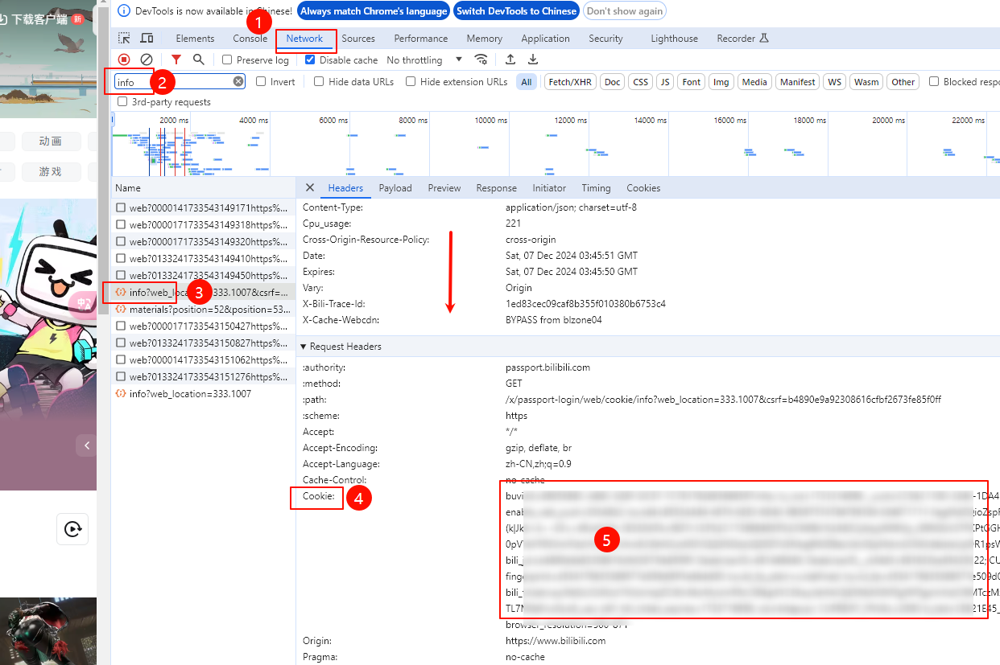
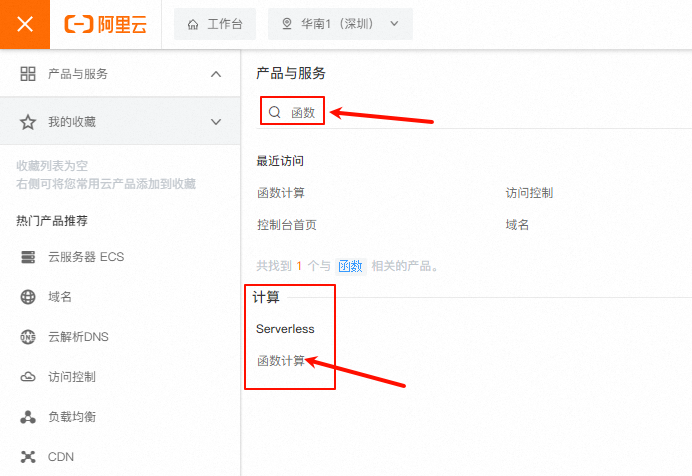
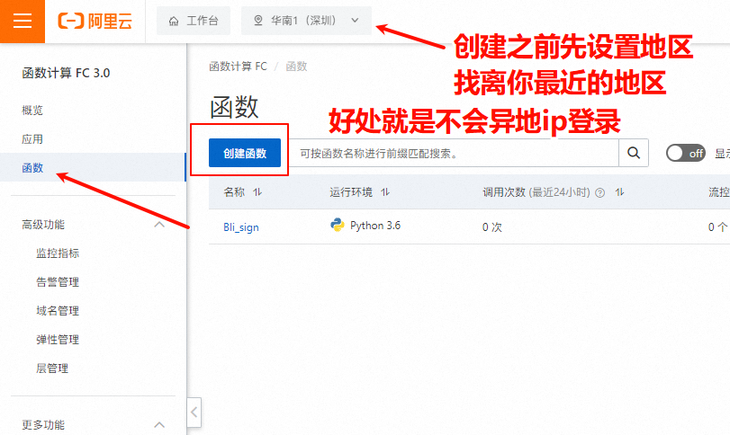

## B站签到脚本

> 来自于github [一键直达](https://github.com/Wyatt1026/BilibiliDailyUp)

::: tip 超级简单

本文保姆级教程，包教包会

::: 

### 已实现功能 总计大概每天65点经验

- 每日5次投币
- 每日分享
- 每日登录
- 观看视频
- 银瓜子兑换硬币
- 添加漫画签到功能

## 使用说明

### 一、获取Cookies

1. 用电脑打开 [哔哩哔哩官网](https://www.bilibili.com/)
2. 按`F12`，打开控制台面板
3. 找到`网络`，英文环境下叫`Network`
4. 复制`cookie`填入配置文件`config/config.py`的`COOKIE_LIST `变量中

::: tip

知道cookie在这里就好了，`重点不在这一步`

保存好cookie，用记事本啥的，或者发到微信备用号，先留着，据我研究，B站的cookie过期时效大概有10个月，看情况，**一般1年左右**。几乎是不过期的

:::

### 二、如何使用\部署

::: info

**原教程**有`阿里云函数`，`腾讯云函数`，还有`青龙面板`

:::

由于我服务器过期了，故没有青龙面板（非常简单），然后腾讯云函数也部署过（也很简单），不说了，而且还收费。

据说阿里云收费低，我就做这个了

#### 1、登录 [阿里云函数](https://fcnext.console.aliyun.com/overview)

打开侧边栏，搜索`函数`，打开**函数计算**

#### 2、创建函数

先选地址，再创建

#### 3、函数配置

