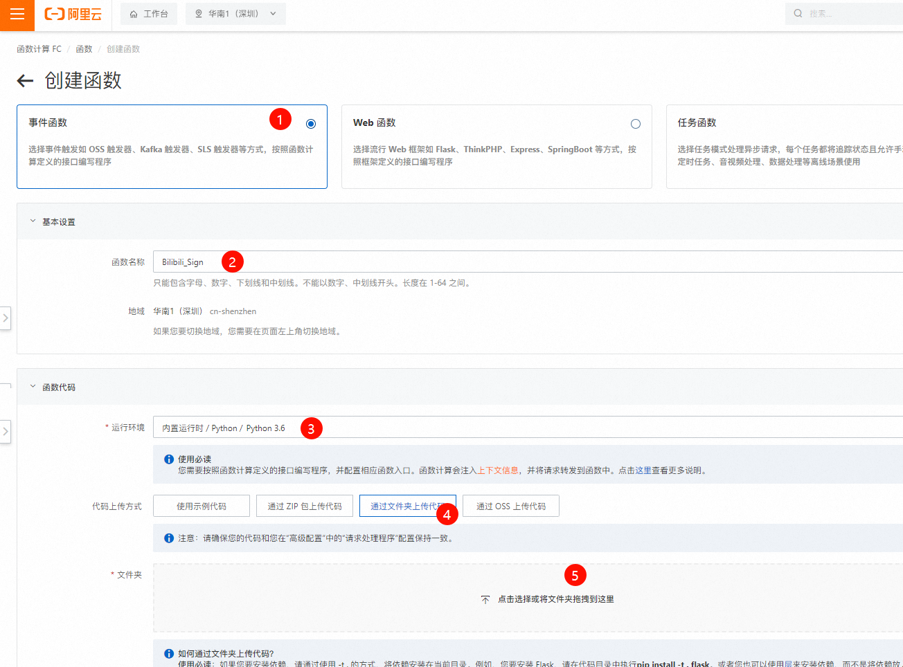
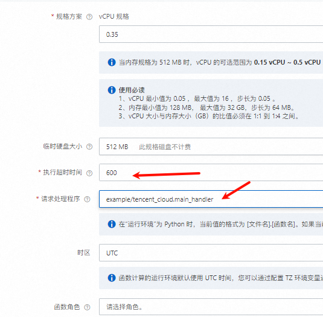
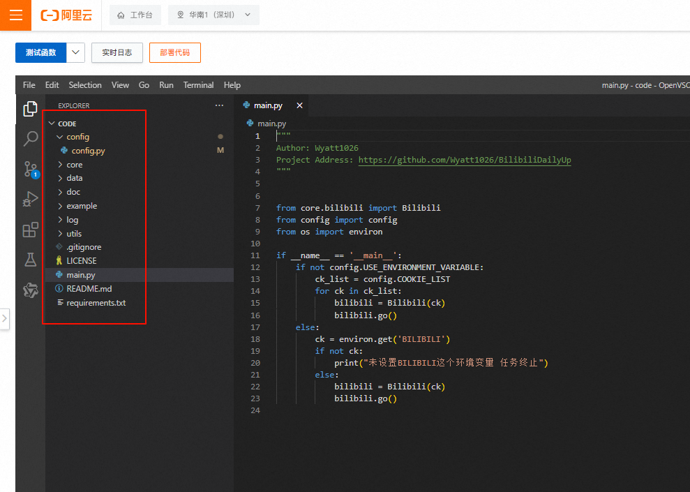
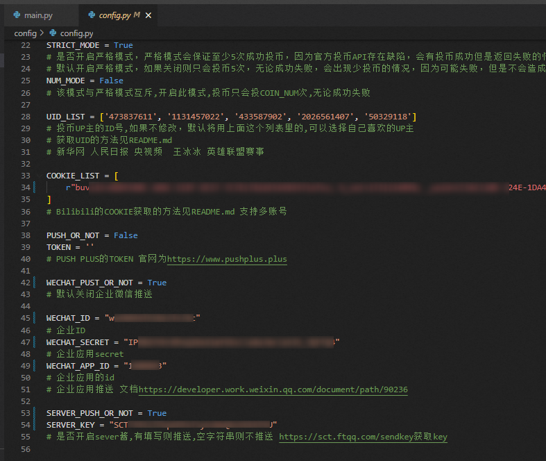

## B站签到脚本

> 来自于github [一键直达](https://github.com/Wyatt1026/BilibiliDailyUp)

::: tip 超级简单

本文保姆级教程，包教包会

::: 

### 已实现功能 总计大概每天65点经验

- 每日5次投币
- 每日分享
- 每日登录
- 观看视频
- 银瓜子兑换硬币
- 添加漫画签到功能


## 使用说明


### 一、获取Cookies

1. 用电脑打开 [哔哩哔哩官网](https://www.bilibili.com/)
2. 按`F12`，打开控制台面板
3. 找到`网络`，英文环境下叫`Network`
4. 复制`cookie`填入配置文件`config/config.py`的`COOKIE_LIST `变量中

::: tip

知道cookie在这里就好了，`重点不在这一步`

保存好cookie，用记事本啥的，或者发到微信备用号，先留着，据我研究，B站的cookie过期时效大概有10个月，看情况，**一般1年左右**。几乎是不过期的

:::


### 二、如何使用\部署

::: info

**原教程**有`阿里云函数`，`腾讯云函数`，还有`青龙面板`

:::

由于我服务器过期了，故没有青龙面板（非常简单），然后腾讯云函数也部署过（也很简单），不说了，而且还收费。

据说阿里云收费低，我就做这个了


#### 1、登录 [阿里云函数](https://fcnext.console.aliyun.com/overview)

打开侧边栏，搜索`函数`，打开**函数计算**


#### 2、创建函数

先选地址，再创建


#### 3、函数配置

- 选择`事件函数`
- 名称命名为`Bilibili_Sign`
- 环境为python，选择`3.6`
- 代码为文件上传(去github仓库克隆到本地，注意上传时不要有多余文件夹)

没有梯子的用我的蓝奏云网盘下载，注意**是上传文件夹**，**~~不是压缩包~~**

[蓝奏云网盘](https://wwgf.lanzouw.com/ilGxr2hfih8d)




#### 4、高级配置

执行时间改**600秒**，还有`请求处理程序`，**要改一下入口文件**

> 在“运行环境”为 Python 时，当前值的格式为 [文件名].[函数名]。如果当前值为 index.handler，那么在函数被触发时，将执行 index.py 文件中的 handler 函数。

```bash
example/tencent_cloud.main_handler
```





> 环境变量不用管了，直接创建

创建成功后，应该是如下图所示，注意，**example文件夹**就是我们刚刚改的执行入口文件

config是配置变量




### 三、配置参数

::: info

默认设置投币，我喜欢存着，所以改为False，看自己需求

:::

- 进入config/config.py文件
- 把浏览器复制的ck放到数组中（字符串“”前面有个r别管他，可以不删，这是py的语法）
- 单击**“测试”**按钮，测试通过后就点击`部署`


> 在Python中，字符串前的`r`表示该字符串是一个原始字符串（raw string）。原始字符串不会处理字符串内的转义字符，这对于包含很多特殊字符（如反斜杠`\`）的字符串来说非常有用。在你的例子中，`COOKIE_LIST`是一个包含单个字符串元素的列表，这个字符串是一个很长的cookie值，里面包含了很多分号和特殊字符。


