## BiliBiliToolPro签到

::: info

保姆级教程，图文结合，更新时间2025-1-2

:::

[github地址](https://github.com/RayWangQvQ/BiliBiliToolPro)

::: info 简介

**BiliBiliTool 是一个自动执行任务的工具，当我们忘记做某项任务时，它会像一个贴心小助手，按照我们预先吩咐它的命令，在指定频率、时间范围内帮助我们完成计划的任务。**

:::

详细功能如下：

- **扫码登录，自动更新cookie**
- **每日获取满额升级经验（登录、投币、点赞、分享视频）（支持指定支持up主）**
- **直播间挂机**
- **每天漫画签到**
- **每天直播签到**
- **直播中心银瓜子兑换为硬币**
- **每月领取大会员赠送的 5 张 B 币券和福利（忘记或者不领就浪费了哦）**
- **每月领取大会员漫画福利**
- **月底在 B 币券过期前进行充电（支持指定想要支持的up主，如果没有喜欢的up，也可以为自己充个电啊，做个用爱为自己发电的人~）**
- **直播中心天选时刻自动参与抽奖**
- **批量取关**
- **大会员大积分任务**
- **支持多账号**
- **理论上支持所有远端的日志推送（默认支持推送到Telegram、企业微信、钉钉、PushPlus、Server酱、钉钉、酷推，另外也支持自定义推送到任意api）**


> 以前来源github作者说明


### 一、获取Cookies

1. 用电脑打开 [哔哩哔哩官网](https://www.bilibili.com/)
2. 按`F12`，打开控制台面板
3. 找到`网络`，英文环境下叫`Network`
4. 复制`cookie`填入配置文件`config/config.py`的`COOKIE_LIST `变量中

::: tip

知道cookie在这里就好了，`重点不在这一步`

保存好cookie，用记事本啥的，或者发到微信备用号，先留着，据我研究，B站的cookie过期时效大概有10个月，看情况，**一般1年左右**。几乎是不过期的

:::


### 二、部署教程

::: warning 

由于服务器过期了，我这里用云函数

[云函数介绍（没啥看的）](https://cloud.tencent.com/document/product/583)

:::

::: info

有用github自动部署的，还有zip上传代码包的，选其中一个方式，能实现就好

完了直接去看测试

:::

[腾讯云函数官网](https://cloud.tencent.com/)，点击过去先注册好

#### A：Actions自动部署（推荐）

[github云函数教程原文](https://github.com/RayWangQvQ/BiliBiliToolPro/blob/main/tencentScf/README.md)

> 该方式可以实现自动定期部署，保证代码始终的最新版本的。

##### a.1 复刻本仓库到自己的GitHub仓库

[仓库地址](https://github.com/RayWangQvQ/BiliBiliToolPro)

由于github是国外地址，小概率打不开

点击本 GitHub 仓库右上角的 `Fork` 按钮，复刻本项目到自己的仓库。

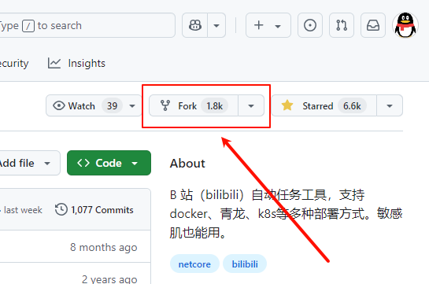

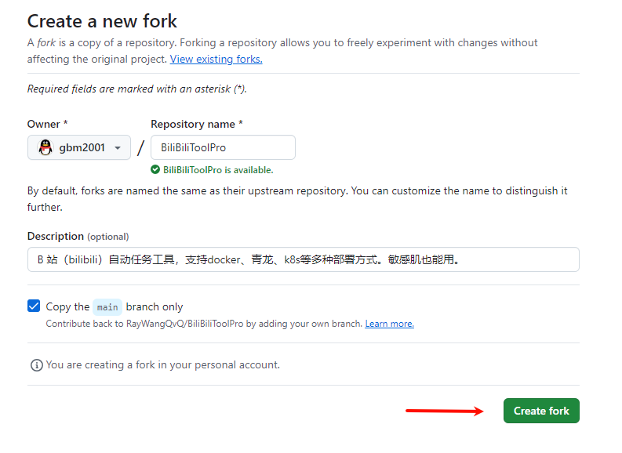

---

**Ⅰ.登录腾讯云后，点击进入[腾讯云密钥管理](https://console.cloud.tencent.com/cam/capi)页面**

> 如果提示创建子账号，可以先拒绝。简单起见，直接使用主账号创建即可。

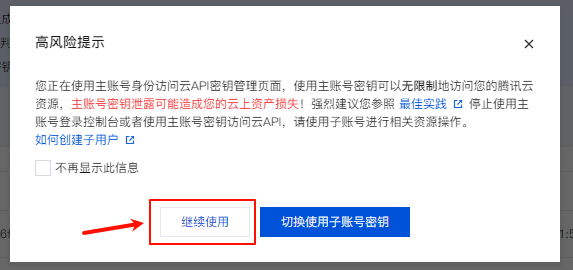

**Ⅱ.点击新建密钥按钮，创建一个密钥。复制并保存 `SecretId` 和 `SecretKey` 两项内容，待会儿会用到它们**

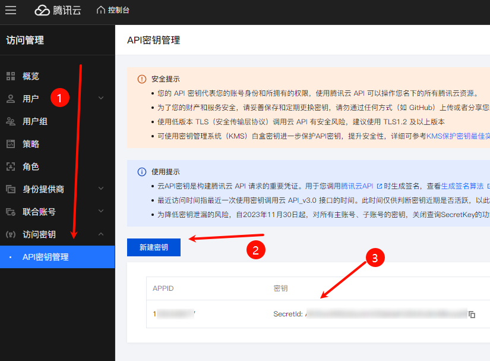

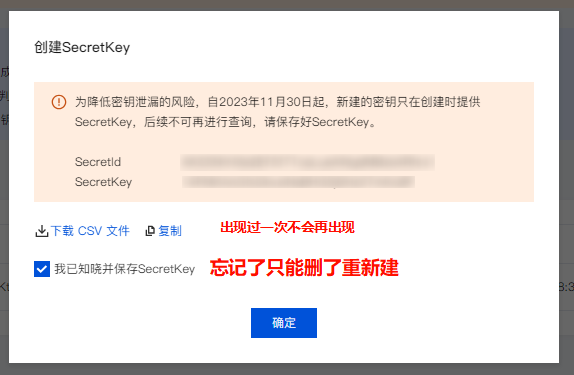

##### a.2 通过 Secrets 添加配置

进入自己 fork 的仓库，点击 `Settings`-> `Secrets and variables`-> `Actions` -> `Repository secrets` -> `New repository secret`

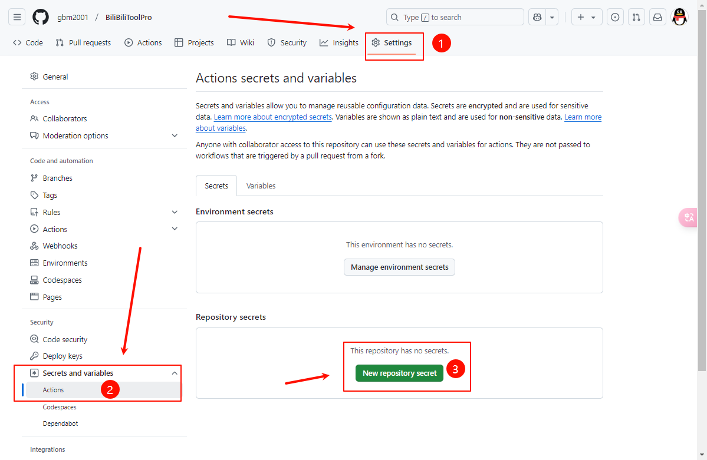

添加如下 Secrets 作为配置：

**密钥相关配置**

这两个配置决定了会部署到哪个腾讯云账户的 SCF 下面。

| 配置名称 | Name                 | Value                        |
| -------- | -------------------- | ---------------------------- |
| Id       | `TENCENT_SECRET_ID`  | 刚才在官网获取到的 SecretId  |
| Key      | `TENCENT_SECRET_KEY` | 刚才在官网获取到的 SecretKey |

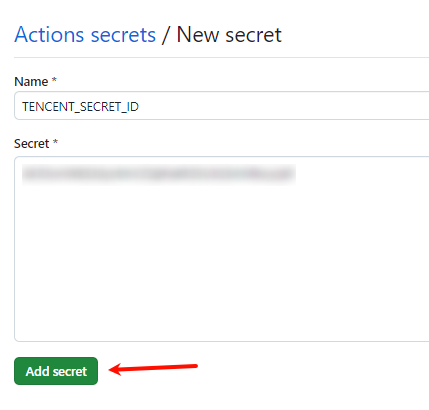

依次把ID和KEY写入，点击`Add secret`

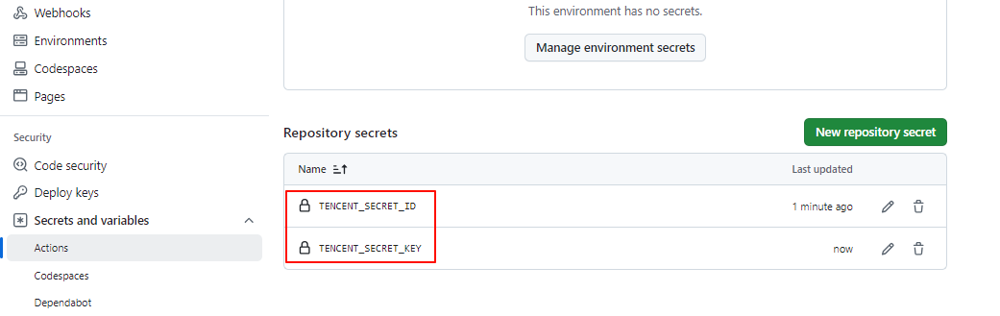


##### a.3 云函数配置

::: info

这一段配置取自原文，具体写入，自行修改

:::

Actions 使用 `Serverless Framework` 来部署，通过 `serverless.yml` 来配置函数信息（如函数应用名称、区域、环境变量和触发器等）。

配置步骤如下：

**Ⅰ.拷贝或下载 [serverless.yml](https://github.com/RayWangQvQ/BiliBiliToolPro/blob/main/tencentScf/serverless.yml) 文件内容到本地文件中，开始编辑内容**

```yml
# https://github.com/serverless-components/tencent-scf/blob/master/docs/configure.md

#组件信息
component: scf
name: bilibili_tool

#组件参数配置
inputs:
  name: ${name}_scf
  namespace: default
  enableRoleAuth: false
  src: ./bin/publish/
  handler: index.main_handler
  runtime: CustomRuntime
  region: ap-guangzhou # 函数所在区域，默认广州
  description: This is a function in ${app} application.
  memorySize: 128
  initTimeout: 30
  timeout: 86400
  asyncRunEnable: true
  traceEnable: true
  events: # 根据自己的需要修改
    - timer: # 每日任务触发器
        parameters:
          name: DailyTask
          cronExpression: "0 30 12 * * * *"
          enable: true
          argument: Daily
    - timer: # 天选抽奖触发器
        parameters:
          name: LiveLotteryTask
          cronExpression: "0 0 */4 * * * *"
          enable: true
          argument: LiveLottery
    - timer: # 自动取关
        parameters:
          name: UnfollowBatchedTask
          cronExpression: "0 0 0 * * MON *"
          enable: true
          argument: UnfollowBatched
    - timer: # 大会员积分
        parameters:
          name: VipBigPointTask
          cronExpression: "0 07 01 * * * *"
          enable: true
          argument: VipBigPoint
  environment:
    variables: # 根据自己的需要修改
      Ray_BiliBiliCookies__1: "buvid3=.........." # cookie，必填
```

其中主要需要改的是最下方的环境变量，这些环境变量在部署后会添加到云函数中（即云函数控制台看到的环境变量集合），它们将作为应用配置传入 bilibili_tool

例如，你需要增加一个**环境变量**，在最下方添加内容应该是（注意缩进问题）：

```js
  environment:
    variables: # 根据自己的需要修改
      Ray_BiliBiliCookies__1: 123 # cookie，必填
      Ray_Security__RandomSleepMaxMin: 20
      Ray_Security__IntervalSecondsBetweenRequestApi: 20
```

注意：其中 cookie 是必填项，其他应用配置的也可以通过添加相应的环境变量实现，建议自己添加UA、推送等配置。（更多配置项请参考[配置说明文档](https://github.com/RayWangQvQ/BiliBiliToolPro/blob/main/docs/configuration.md)，仅用于参考环境变量，请只关注表格中的`环境变量`一项，并参照上面的方式添加）

>如果你不熟悉 yml 或者部署时遇到格式问题，建议花几分钟阅读 [YAML 入门教程](https://www.runoob.com/w3cnote/yaml-intro.html) 常犯错误： Q：我在 Github Secrets 中添加了 `NUMBEROFCOINS`，值为 2，为啥投币数量还是 5。 A：所有自定义配置项（环境变量） *不能通过 Github Secrets 添加*，只能写在 `serverless.yml` 中。你应该参考上面的例子添加环境变量 `Ray_DailyTaskConfig__NumberOfCoins`。

其他 `serverless.yml` 可选配置内容请参考[官方说明](https://github.com/serverless-components/tencent-scf/blob/master/docs/configure.md)

---

::: tip

上面取自原文，其实就是写配置项，把ck填进去，然后改任务启动时间啥的，直接用我下面已经写好的，改成你的ck就好了

:::

```yml
#组件信息
component: scf
name: bilibili_tool

#组件参数配置
inputs:
  name: ${name}_scf
  namespace: default
  enableRoleAuth: false
  src: ./bin/publish/
  handler: index.main_handler
  runtime: CustomRuntime
  region: ap-guangzhou # 函数所在区域，默认广州
  description: This is a function in ${app} application.
  memorySize: 128
  initTimeout: 30
  timeout: 86400
  asyncRunEnable: true
  traceEnable: true
  events: # 根据自己的需要修改
    - timer: # 每日任务触发器
        parameters:
          name: DailyTask
          cronExpression: "0 5 10 * * * *"
          enable: true
          argument: Daily
    - timer: # 天选抽奖触发器
        parameters:
          name: LiveLotteryTask
          cronExpression: "0 0 */4 * * * *"
          enable: true
          argument: LiveLottery
    - timer: # 自动取关
        parameters:
          name: UnfollowBatchedTask
          cronExpression: "0 0 0 * * MON *"
          enable: true
          argument: UnfollowBatched
    - timer: # 大会员积分
        parameters:
          name: VipBigPointTask
          cronExpression: "0 07 01 * * * *"
          enable: true
          argument: VipBigPoint
  environment:
    variables: # 根据自己的需要修改
      Ray_BiliBiliCookies__1: "buvid3=.........." # cookie，必填 // [!code warning]
      Ray_BiliBiliCookies__2: "buvid3=.........." # 没有多个就删除这一行 // [!code error]
      Ray_DailyTaskConfig__NumberOfCoins: 0 # 每日任务投币数量 我喜欢白嫖
      Ray_Security__UserAgent: "Mozilla/5.0 (Windows NT 10.0; Win64; x64) AppleWebKit/537.36 (KHTML, like Gecko) Chrome/122.0.6261.95 Safari/537.36"
```

> 这里的变量还可以再加，例如推送消息等，推送消息我放到后面去了，到时候来这里复制，然后最底下加几个变量就好了，然后更新一下github仓库的那个secrets，再推送到云函数就好了

改成你的ck，没有多个就把ck2去掉，复制全部，写入到github仓库中

**Ⅱ.拷贝修改后的内容，将其整个添加到 secrets 中**

| 配置名称           | Name                     | Value                  |
| ------------------ | ------------------------ | ---------------------- |
| serverless.yml内容 | `TENCENT_SERVERLESS_YML` | 刚才拷贝的整个文件内容 |

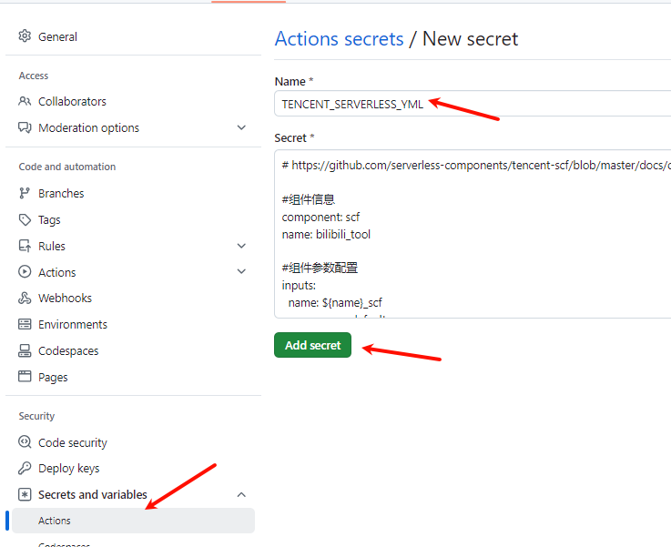


##### a.4 手动执行action

第一次进来，和后续进来不一样，这里我做下区分

Ⅰ.**第一次执行**

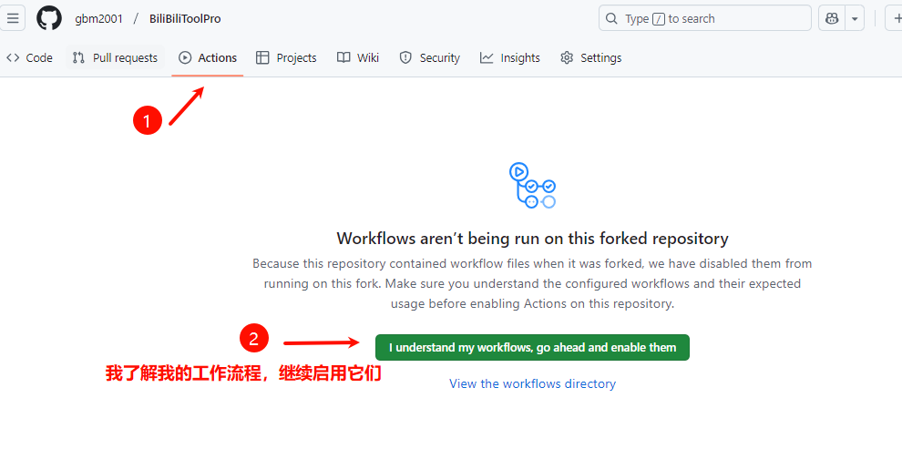

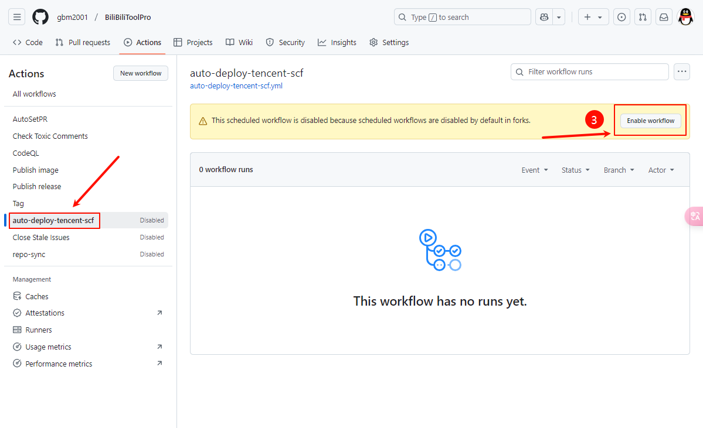

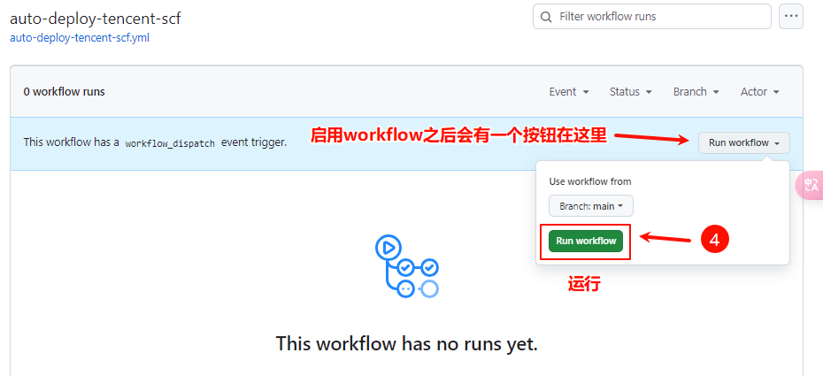

点运行的时候等一下，网络有点慢，我点了几次，给我运行了多次，淦

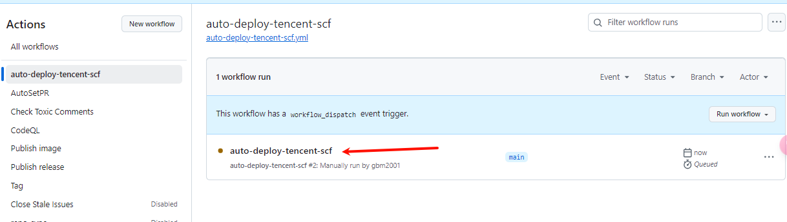

等待1分钟时间，也不要那么久，刷新页面，变成打钩就好了，如下图

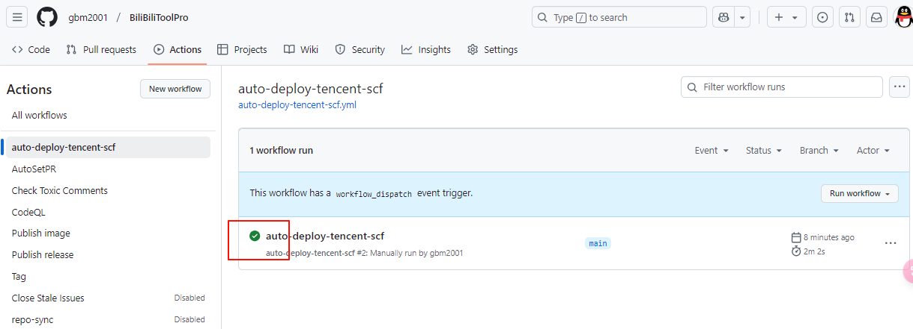

如果部署成功，那么登录自己的腾讯云函数控制台，就可以看到对应的函数应用了。

**跳到第三章**


#### B：上传zip包部署


### 三、云函数测试

#### **1.进入函数**

成功部署好函数后，会看到如下的函数服务页面，点击函数名（我圈出来的）

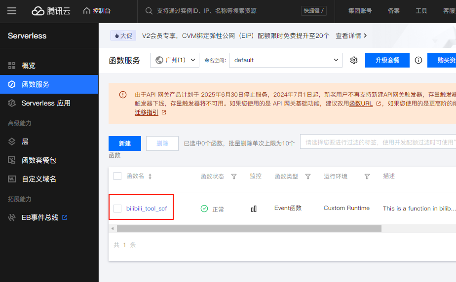


#### **2. 找到测试**

找到函数管理-》函数代码，往下滑

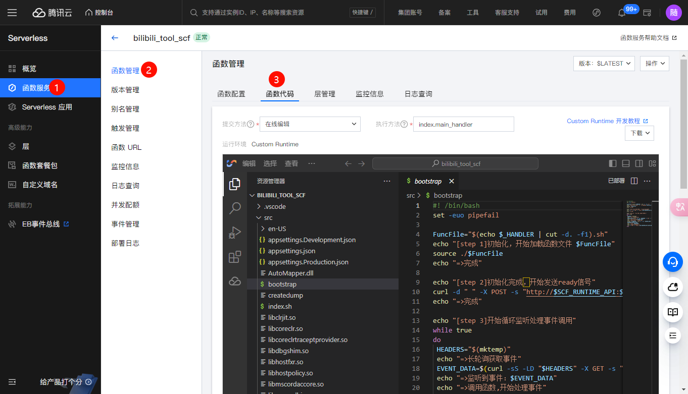


#### **3. 执行测试**

将之前配置的环境变量`Ray_RunTasks`删除，后续函数将自动执行触发器中配置的功能任务

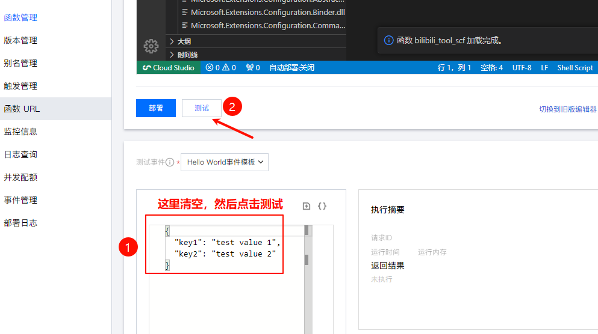


#### 4.分析是否成功

点完了测试，右下角会出现`日志`，而且这个日志，很长，一直拉不上去，还会把浏览器卡死，问题不大，刷新浏览器一下，咱不在这里看日志


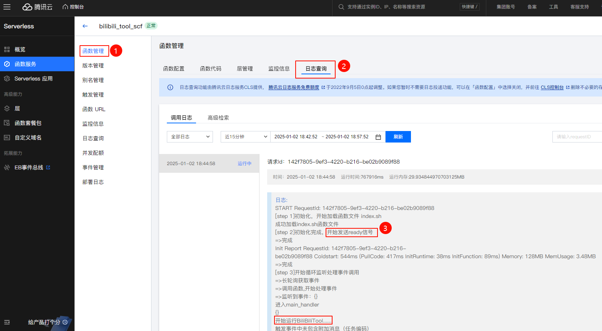

往下拉

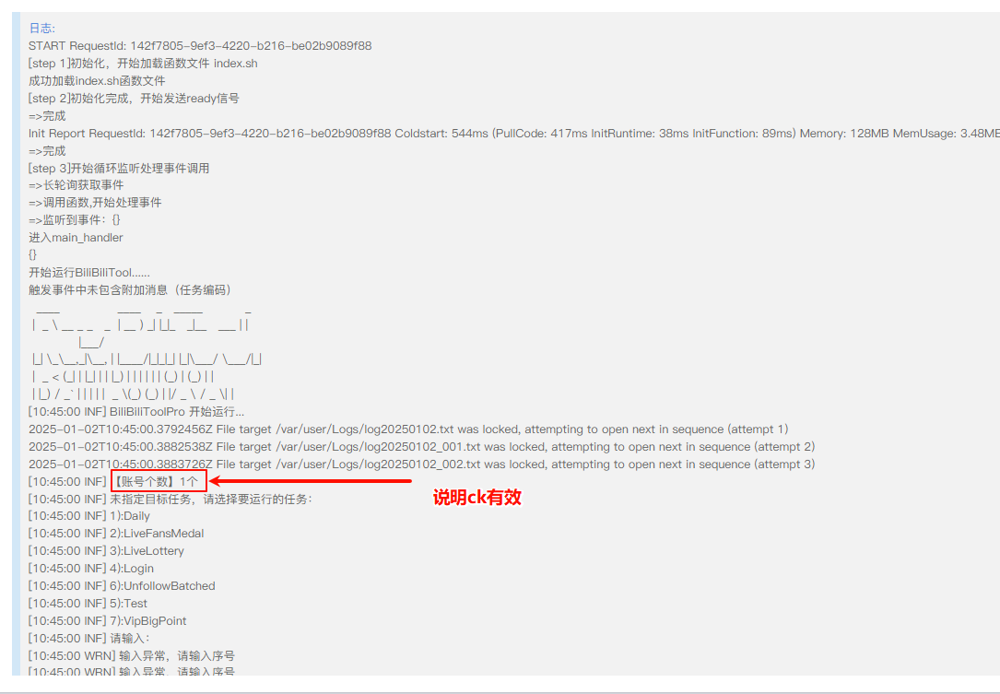

如果账号个数为0，或者其他报错，就是有步骤出了问题


#### 5.定时执行

在之前的**yml配置文件**中，其实已经有`定时器`的代码了，云函数会自动识别。并且在列表生成

找到触发管理

1. UnfollowBatchedTask——批量取关（天选时刻分组）
2. VipBigPoint——大会员领取积分（没会员没用）
3. Daily——每日任务（最重要）
4. LiveLottery——天选时刻抽奖（没啥用）

> 应该一样的有4个，
>
> 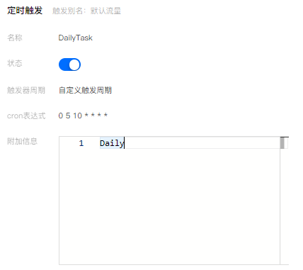
>
> 

从github同步的，因为有yml配置文件，所以不需要手动创建触发器，如果是zip上传代码包，就需要手动创建

#### 6. 关于云函数

因为云函数是收费的，如下图

::: info

其实是心痛的，如果有青龙面板（需要买服务器），或者本地虚拟机之类的就更好了。

:::

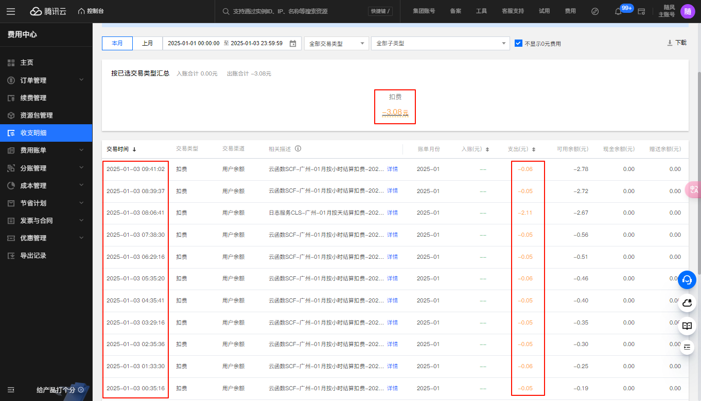

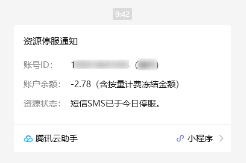


我看github教程里面有提到白嫖，具体不知，跟着做一遍

[原文链接](https://github.com/RayWangQvQ/BiliBiliToolPro/blob/main/tencentScf/README.md#4-%E6%B5%8B%E8%AF%95)

##### 6.1 关于腾讯云日志

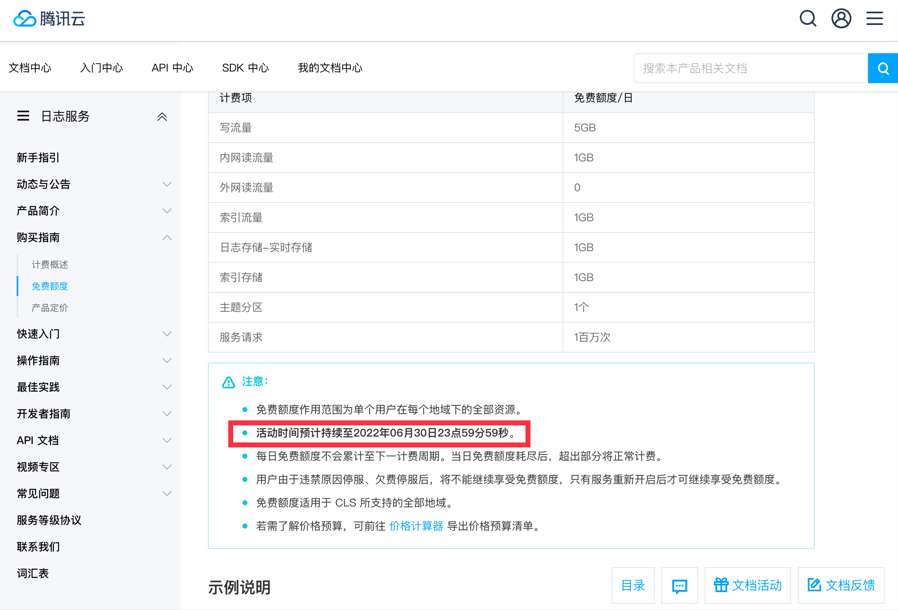

##### 6.2 白嫖教程

如果需要完全白嫖(即不需要任何费用)的话，可以切至[腾讯云日志服务页](https://console.cloud.tencent.com/cls/topic?region=1)

::: warning

无脑下一步，然后用微信扫码确定就好了

:::

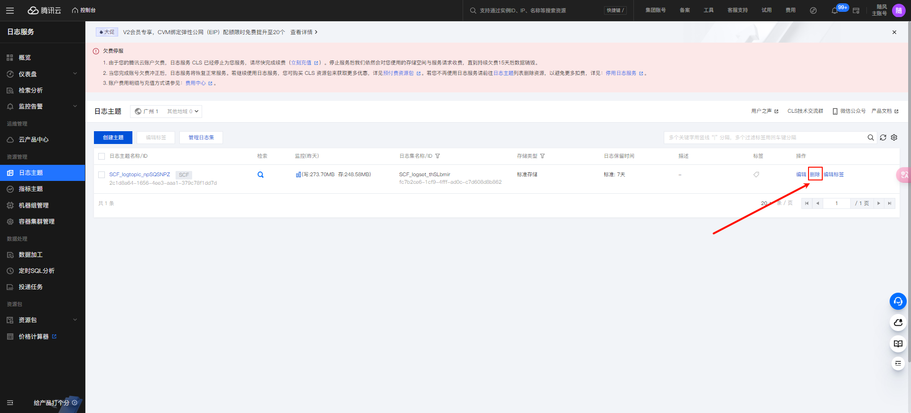

**点击删除，则将删除此日志主题，云函数因为无法定位到日志集，就不会产生额外费用。**
