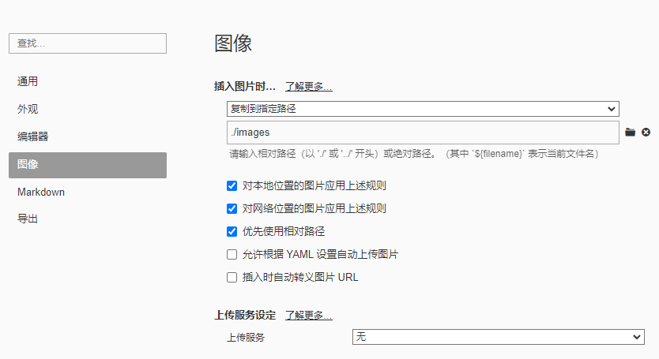

# javascript 入门

> 

:::tip 测试

This is a details block.

:::

::: code-group

```js [config.js]
/**
 * @type {import('vitepress').UserConfig}
 */
const config = {
  // ...
};

export default config;
```

```ts [config.ts]
import type { UserConfig } from "vitepress";

const config: UserConfig = {
  // ...
};

export default config;
```

:::

测试

```javascript
import * from
```


绝对 ↑

相对下 ↓ ../../../images/test1.jpg


## 标题 2

测试 123456

还可以

### 标题 3

```bash
1
2
3
4
5

```

## 标题二级

> 112233

1. 这是测试有序
2. 有序 2

```html
<div class="header">
  <el-form :inline="true" :model="queryParams" class="demo-form-inline">
    <el-form-item label="年份">
      <el-date-picker
        v-model="queryParams.year"
        type="year"
        placeholder="选择年"
        value-format="yyyy"
        @change="getList"
      >
      </el-date-picker>
    </el-form-item>
    <el-form-item label="月份">
      <el-select
        v-model="queryParams.month"
        placeholder="选择月"
        clearable
        @change="getList"
      >
        <el-option v-for="item in 12" :key="item" :label="item" :value="item">
        </el-option>
      </el-select>
    </el-form-item>
    <el-button type="primary" icon="el-icon-search" @click="getList"
      >搜索</el-button
    >
  </el-form>
</div>
```
