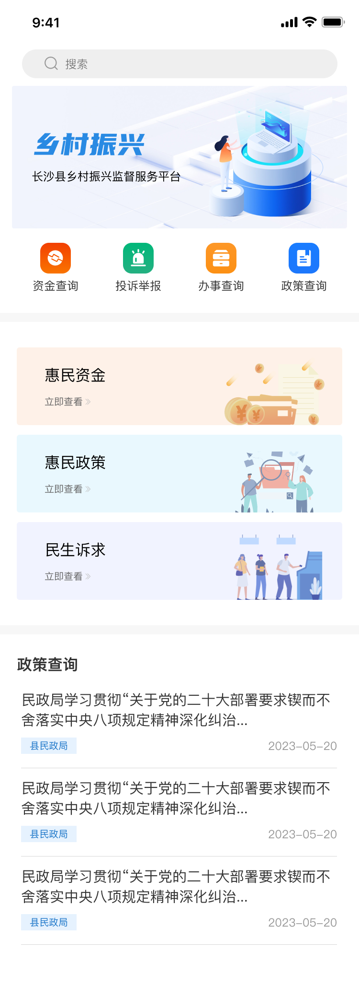
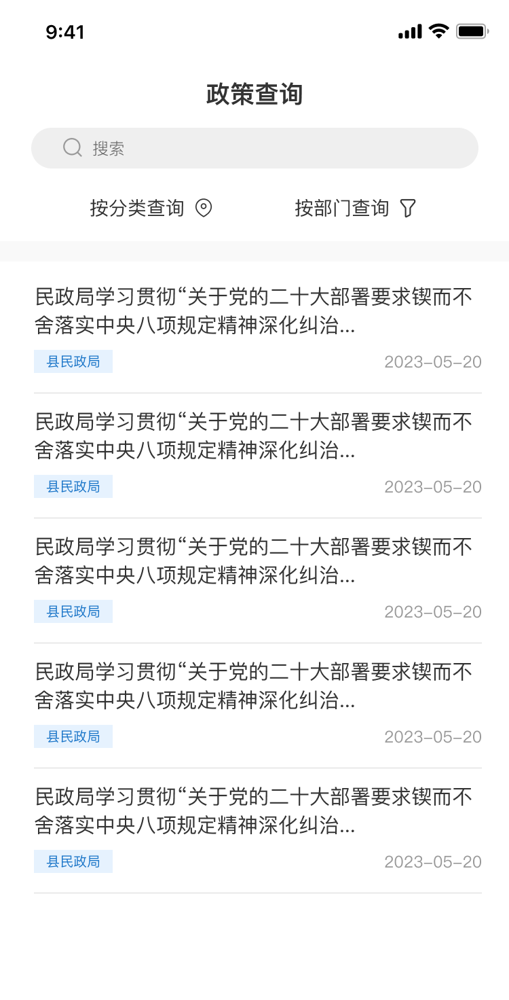
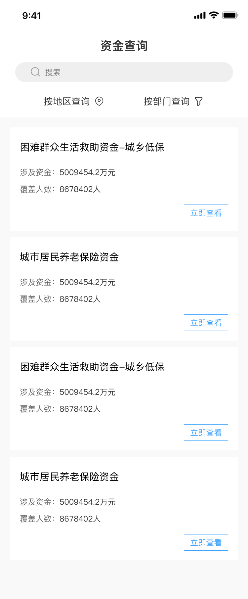
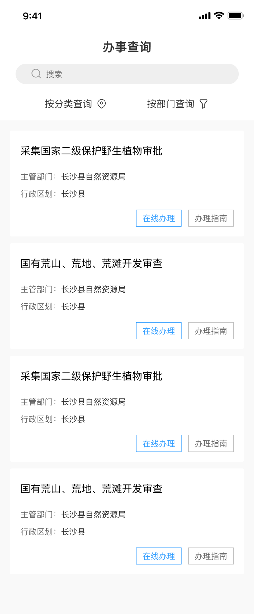
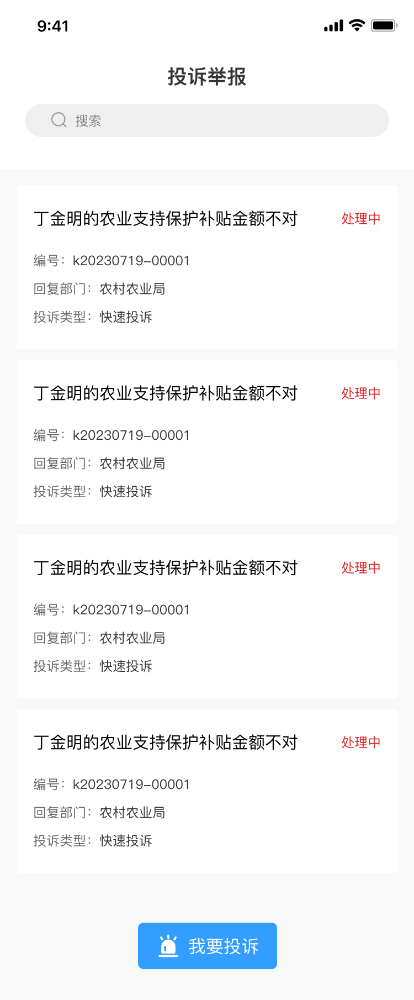
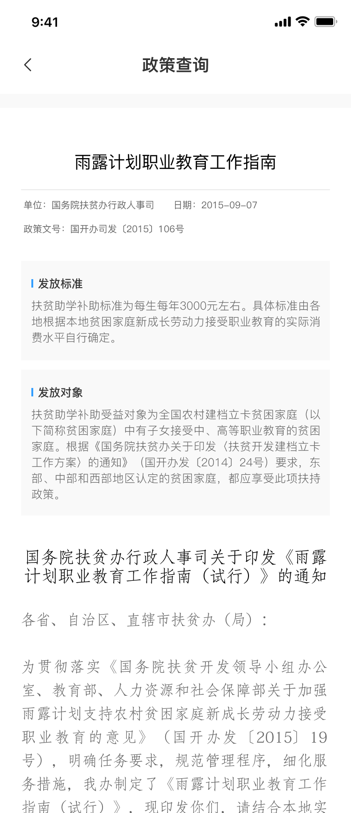
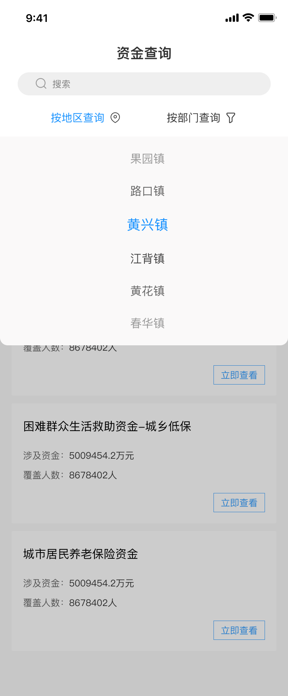
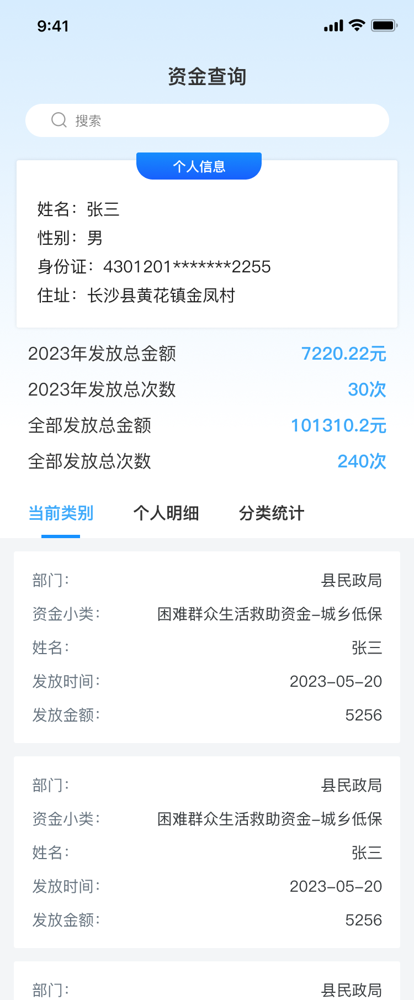

## 项目介绍

如标题，乡村振兴

类似于一个博客网站，就是发表文章、咨询内容等

4个模块

1. 政策：类似于公开文章
2. 资金：表格数据
3. 办事：也是类似于数据
4. 投诉：这个是自己用户提交的投诉

### pc端

> vue2+elementUI

首页有用到swiper组件，项目依旧是分组件化开发，顶部header和尾部footer组件，拼接上下两部分。

然后中间的一直是路由变化，tab则是监听变化。

#### 设计图

|  |  |    |
| -------------------------------- | -------------------------------- | ---------------------------------- |
|  |  |  |

### app端

> vue2+vantUI

主要页面都很简单，就是一个博客网站

#### 设计图

|      |  |  |
| -------------------------- | -------------------------- | -------------------------- |
|  |  |  |
|  |  |                            |

