## 项目介绍

吊车的买卖，主要以电话交接，用户填写自己的吊车买卖需求，发布之后，等待其他人拨打电话，询问吊车。类似于boss直聘，主要是买卖吊车

> 原生微信小程序，组件库**van-weapp**

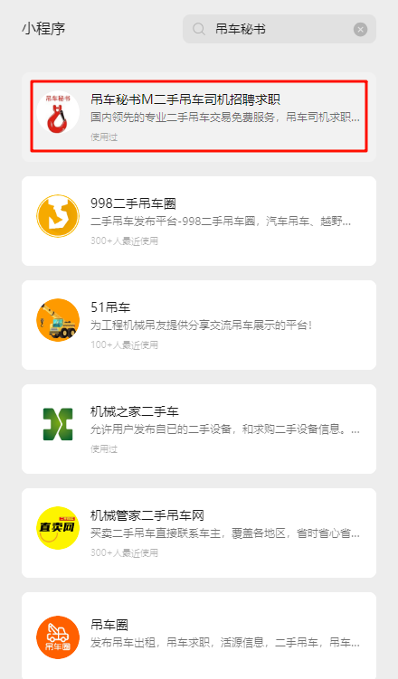

### 买车卖车模块

原先小程序，首先有5个tabBar页面

1. 首页：卖车列表，按条件查询，以及登录后的个人信息
2. 卖车：填写表单，联系方式。
3. 帮我找车：就是填写自己的需求表单，以及找车列表
4. 联系我们
5. 我的：这里有管理自己的收藏列表，管理员有车源管理，可以随时**审核**车辆的上架下架以及修改内容

|  | 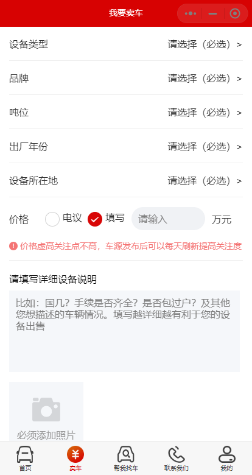 | 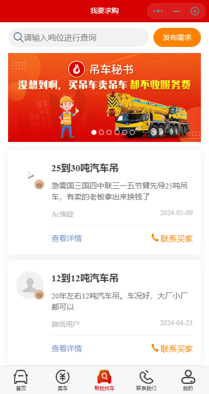 |
| ------------------------------------------------------------ | ------------------------------------------------------------ | ------------------------------------------------------------ |
| 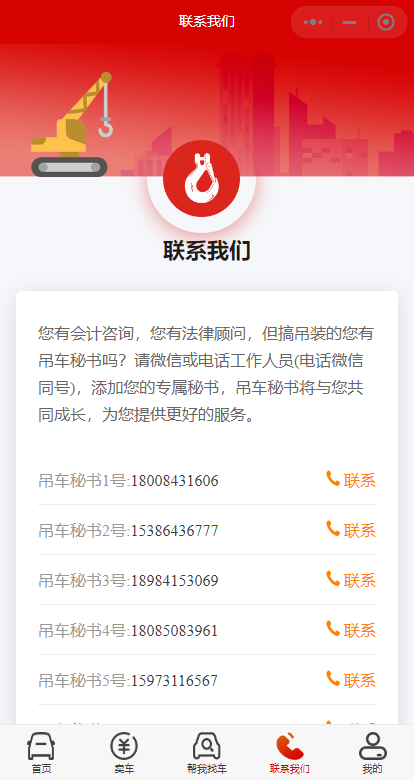 | 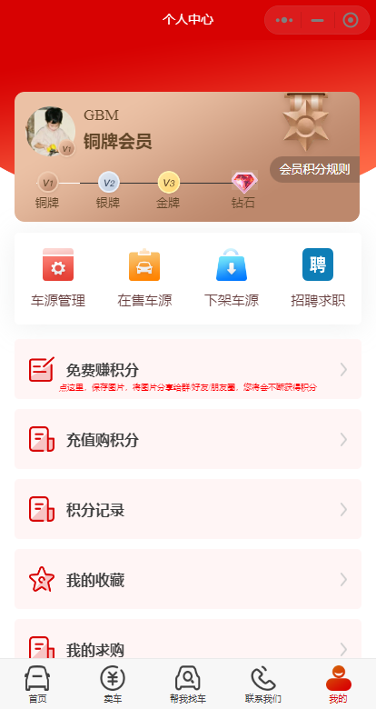 | 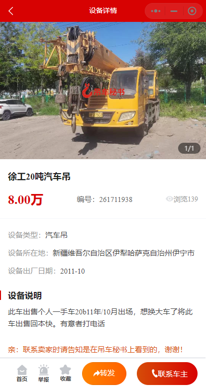 |
| 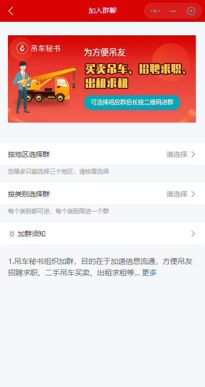 | 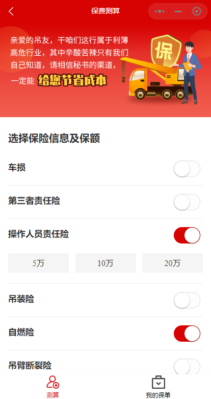 | 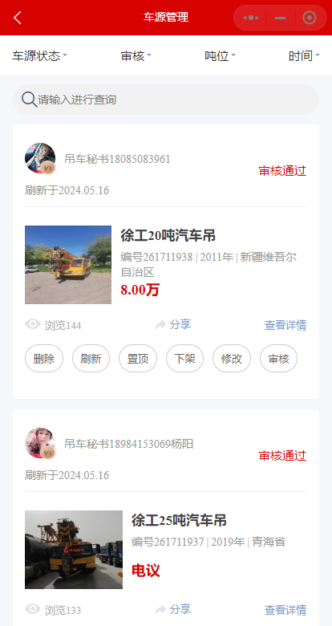 |

### 出租求租+招聘求职

新写模块，在买卖的基础上，新增出租和求租。以及招聘求职。

算4个模块

#### 出租求租

| 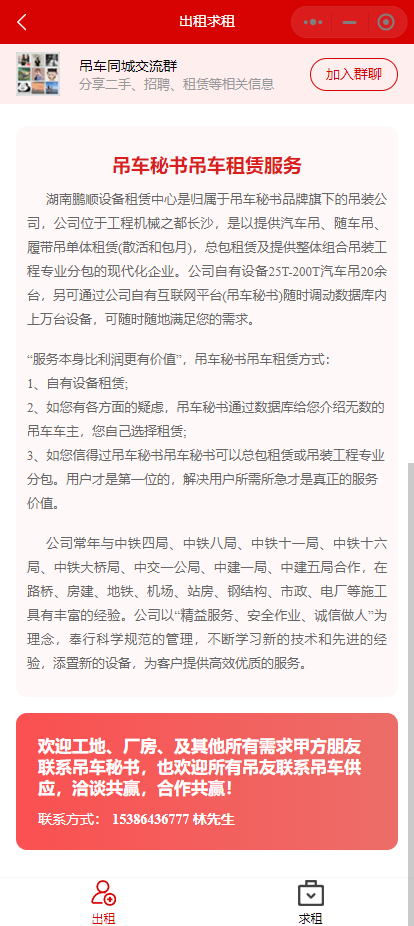 | 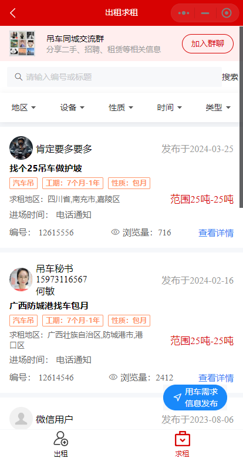 | 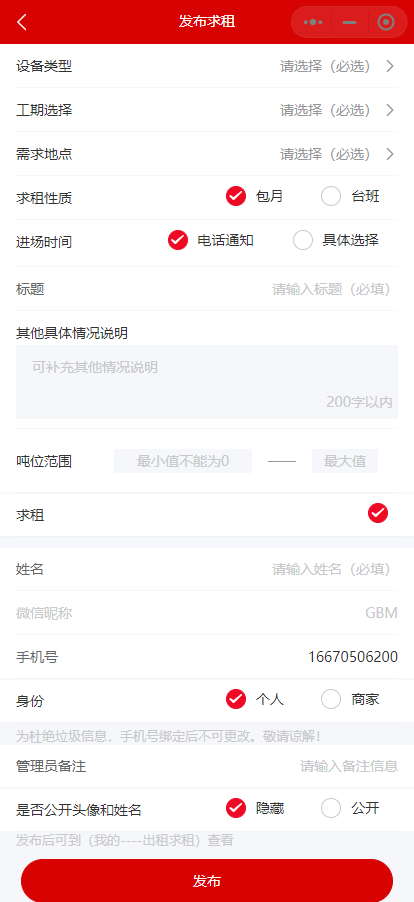 |
| ------------------------------------------------------------ | ------------------------------------------------------------ | ------------------------------------------------------------ |
| 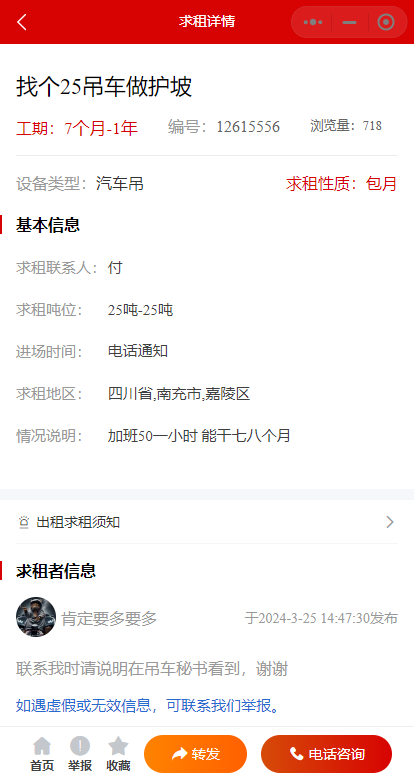 | 求租管理页面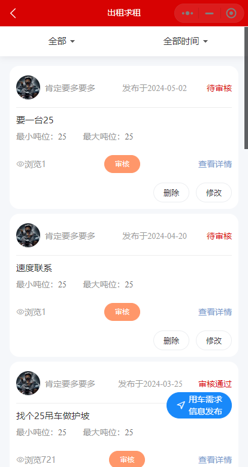 |                                                              |

#### 招聘求职

招聘与求职，表单内容类似，列表内容类似，所以放在了同一级页面，以左右tabBar分开。

这个页面是由2个子组件拼接而成

而且招聘求职，在管理员登录时，也拥有审核模块，可以**实时审核招聘求职**。

| 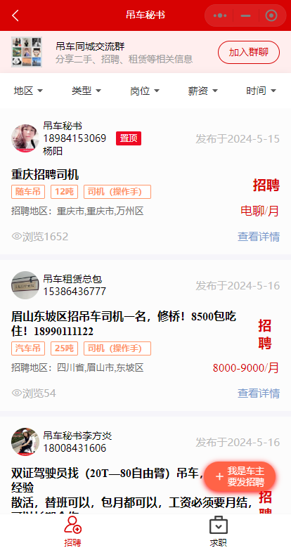 | 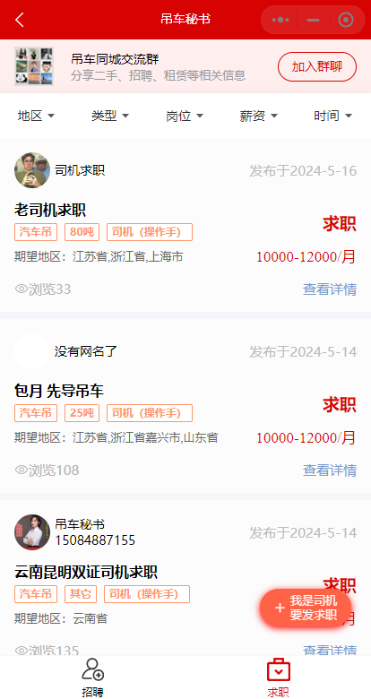 | 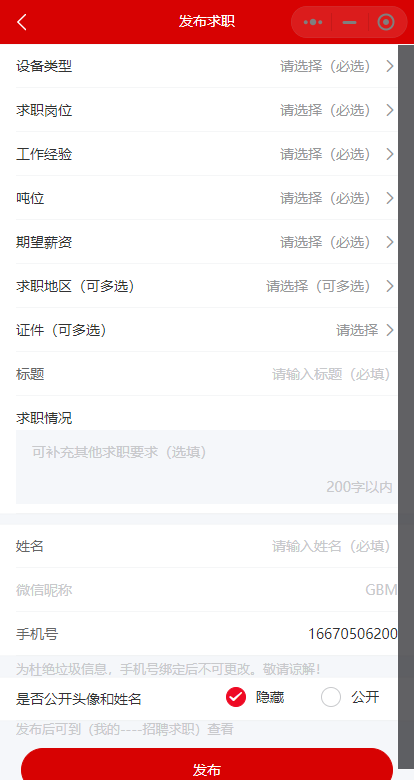 |
| ------------------------------------------------------------ | ------------------------------------------------------------ | ------------------------------------------------------------ |
| 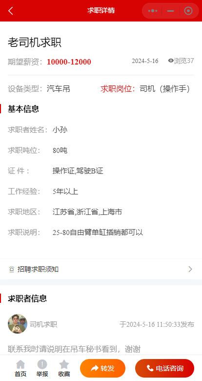 | 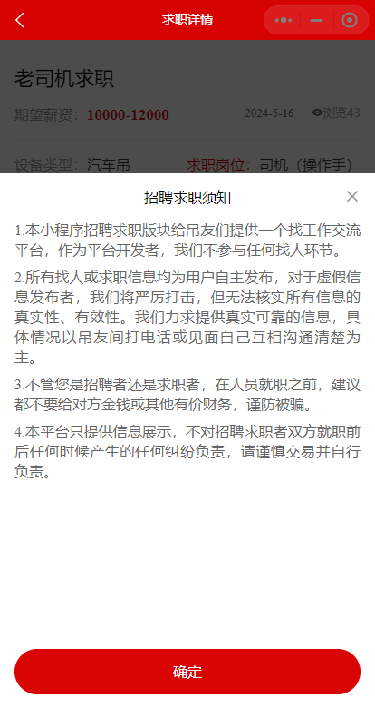 | 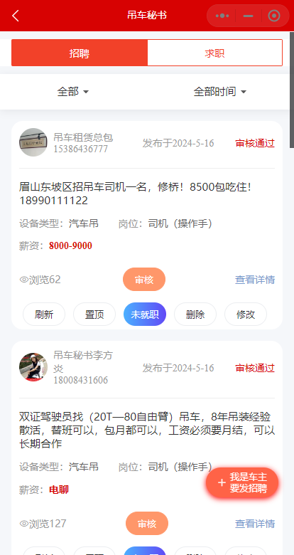 |

#### 其他页面

生成积分页，充值积分，积分记录

|  | 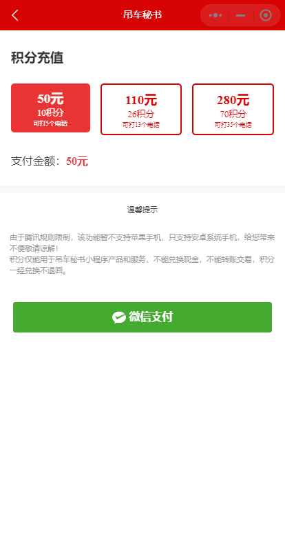 | 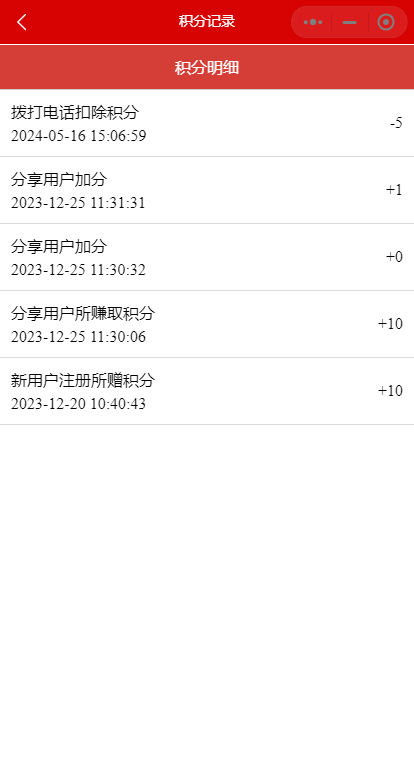 |
| ------------------------------------------------------------ | ------------------------------------------------------------ | ------------------------------------------------------------ |
| 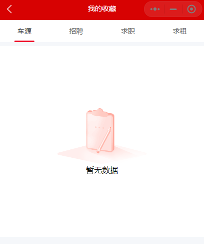 |  | 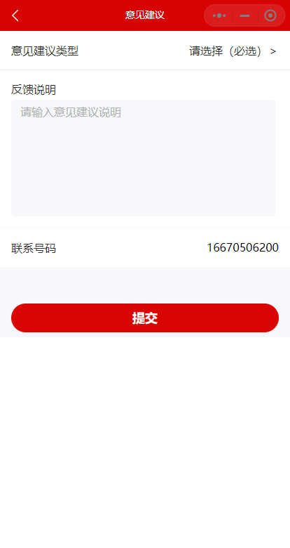 |

