## 项目介绍

该项目是嵌入在手机端**在星沙**app中，因此项目是对接了手机端sdk文件的，用来获取登录用户信息，用户信息通过vuex存储

> 无纸化办公系统的1.0版本，最开始是一个**会议系统**，功能为发起会议，修改会议，参加会议回复等。

后台为原始会议系统的后台里面加模块，项目是layui

后面新增模块

1. 公文
2. 请假
3. 任务

三个模块

项目始于22年9月，周期2个月，但是后续修改、维护，加要求，持续了两个月

::: tip

项目定位是oa系统，模仿钉钉的无纸化办公批文系统。由于是1.0，所以只有手机端

:::

### 公文模块

::: warning

发起公文和任务，内容都是一模一样的，但是领导的需求就是，需要两个不同的类型，但是内容表单字段都一致，所以共用了公文的处理页面，详情页面

:::

> vue2 + vantUI

功能点

1. 可以签收，签收后再办理
2. 已提交的可以修改意见
3. 自定义选人
4. 抄送处理和正常处理无区别，但是抄送不影响正常任务

| 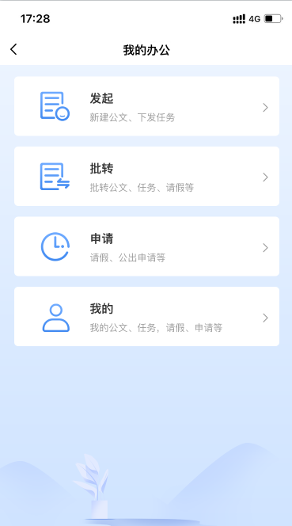 | 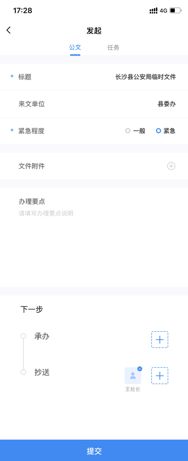 | 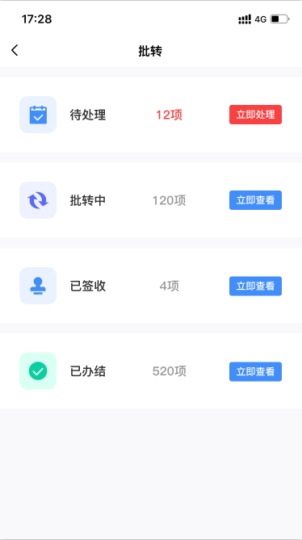 |
| ------------------------------------------------------------ | ------------------------------------------------------------ | ------------------------------------------------------------ |
| 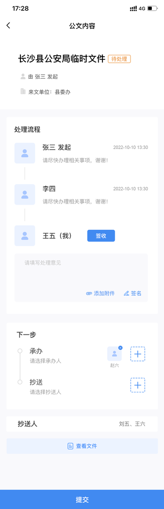 | 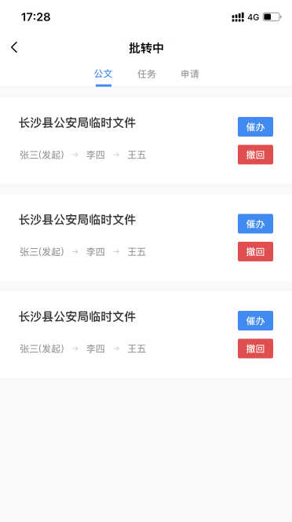 |                                                              |

### 请假模块

请假比公文简单，因为请假只有，提交或者，不通过

| 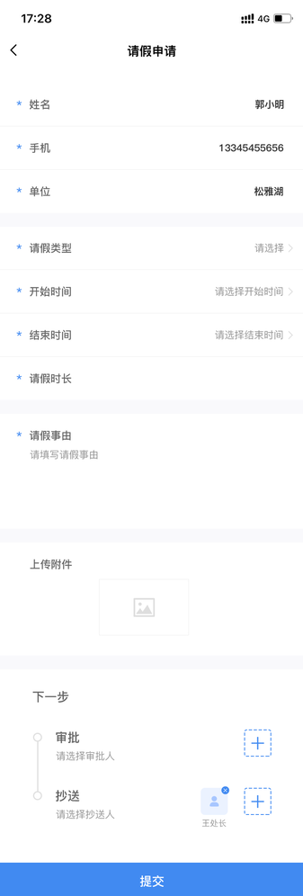 | 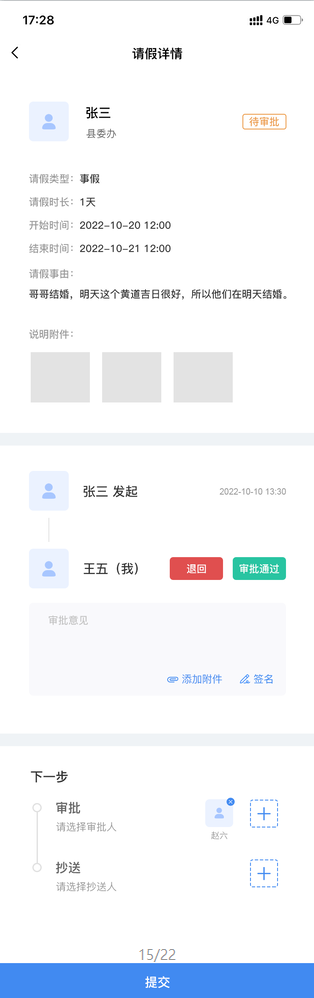 | 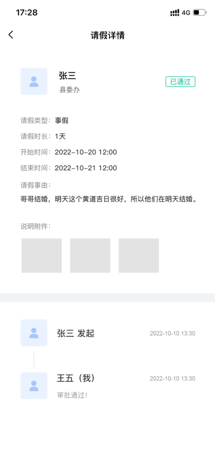 |
| ------------------------------------------------------------ | ------------------------------------------------------------ | ------------------------------------------------------------ |
|                                                              |                                                              |                                                              |

### 会议模块

这个会议，可以创建，然后再修改，并且有会议签到，有统计参会人数

| 创建会议                                                     | 最新会议                                                     | 会议详情                                                     |
| ------------------------------------------------------------ | ------------------------------------------------------------ | ------------------------------------------------------------ |
| 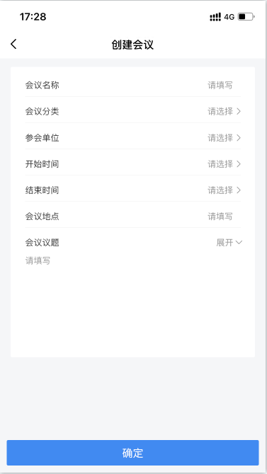 | 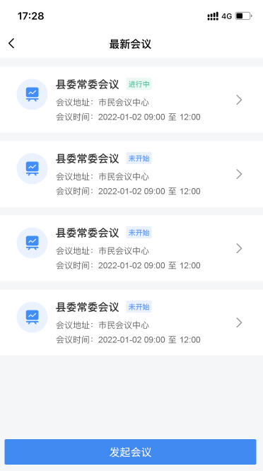 | 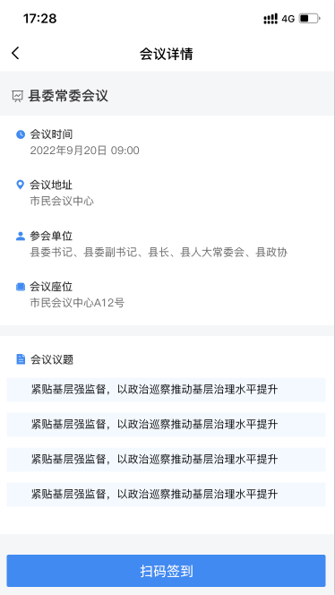 |

| 会议主页                                                     | 我的会议                                                     |      |
| ------------------------------------------------------------ | ------------------------------------------------------------ | ---- |
| 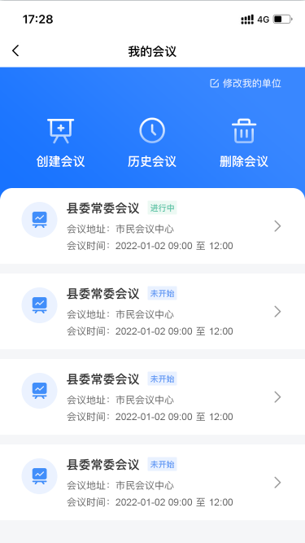 | 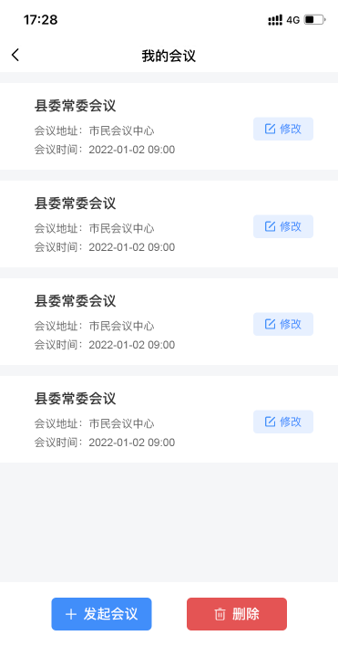 |      |

| 会议签到                                                     | 领取参会资料                                                 |      |
| ------------------------------------------------------------ | ------------------------------------------------------------ | ---- |
| 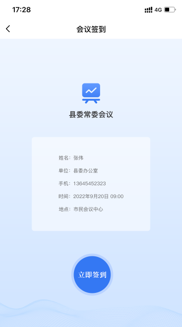 | 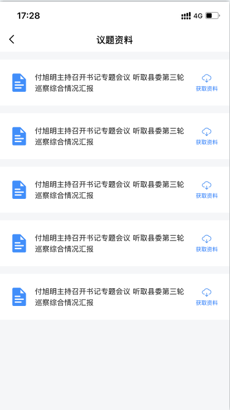 |      |

#### 日程模块

| 日程列表                                                     | 日程详情                                                     | 日程所在会议内容                                             |
| ------------------------------------------------------------ | ------------------------------------------------------------ | ------------------------------------------------------------ |
| 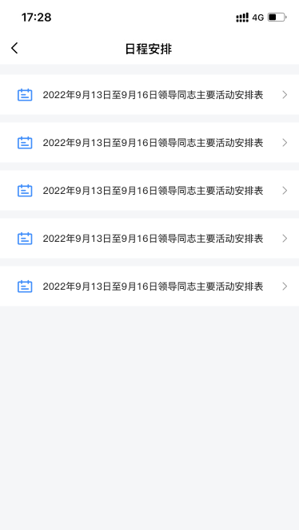 | 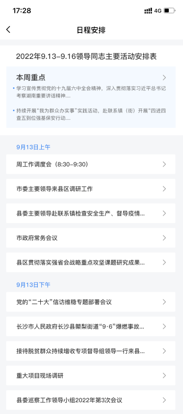 | 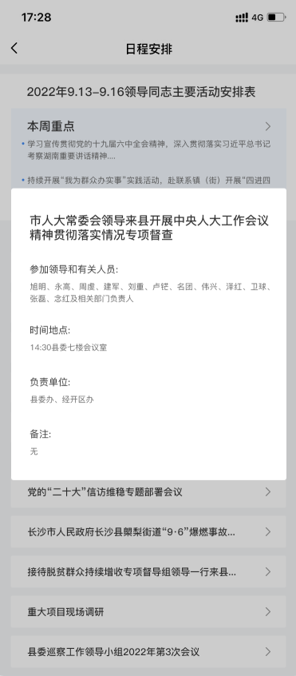 |

### 其他页面

**我的**

> 所有自己发起的都在这里显示

**文件**

> 列表，文件在这里也算**1个模块**
>
> 文件是可以，通过二维码分享的，然后app扫码获取文件，再导入进来，成为个人收藏文件，也可以个人上传文件

| 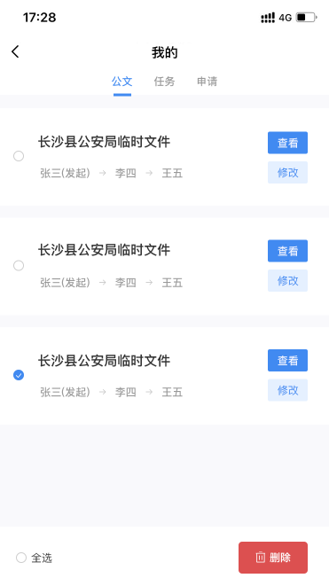 | 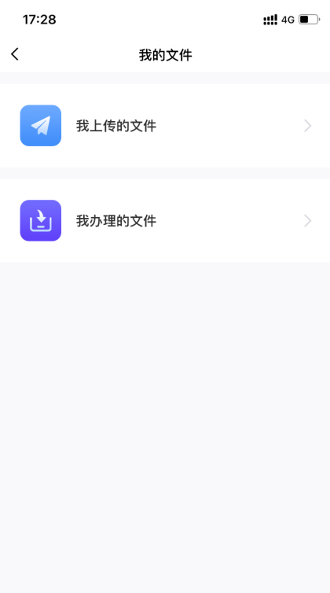 | 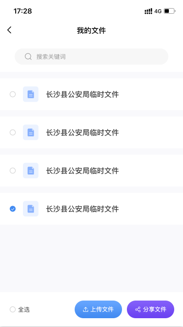 |
| ------------------------------------------------------------ | ------------------------------------------------------------ | ------------------------------------------------------------ |
|                                                              |                                                              |                                                              |

