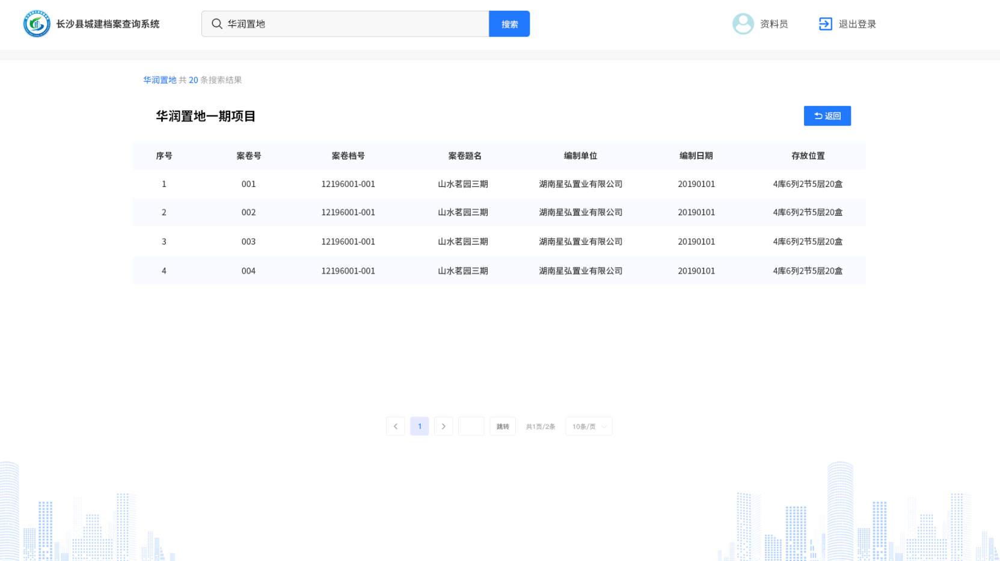
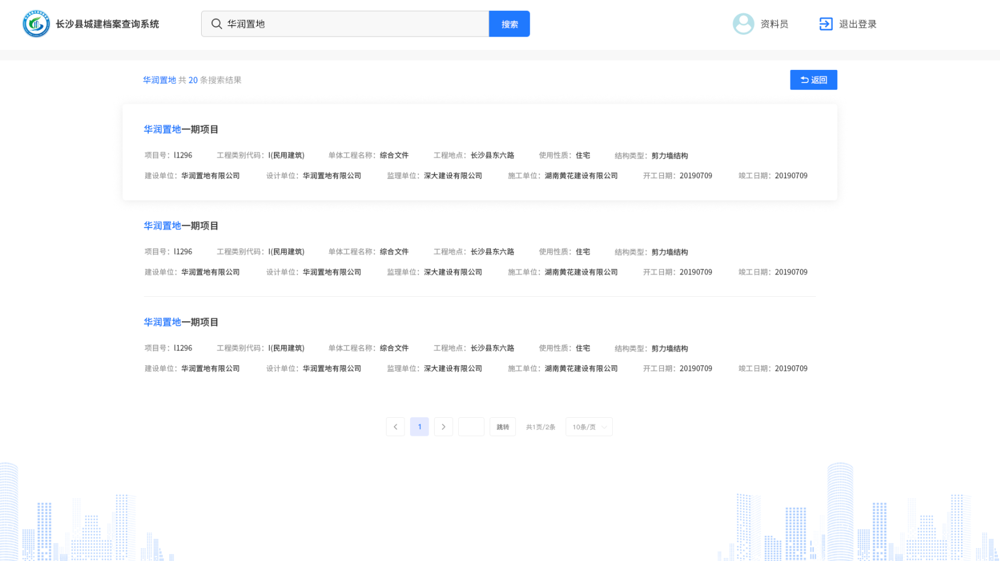
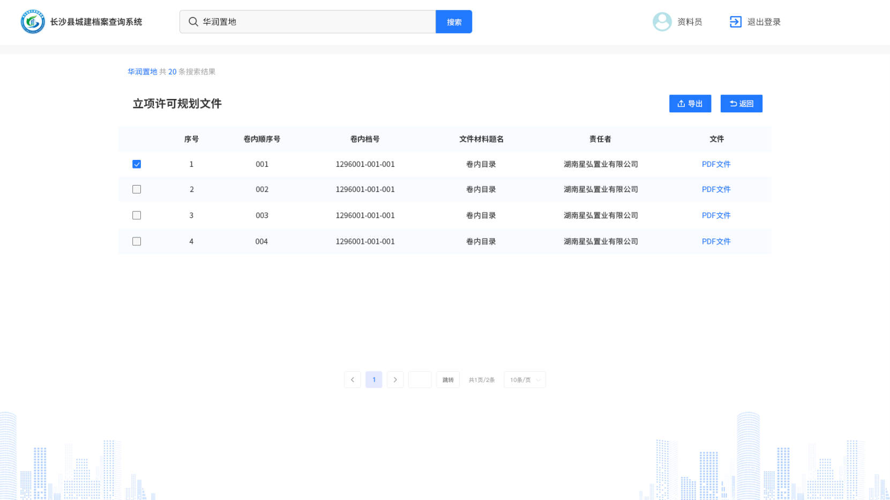
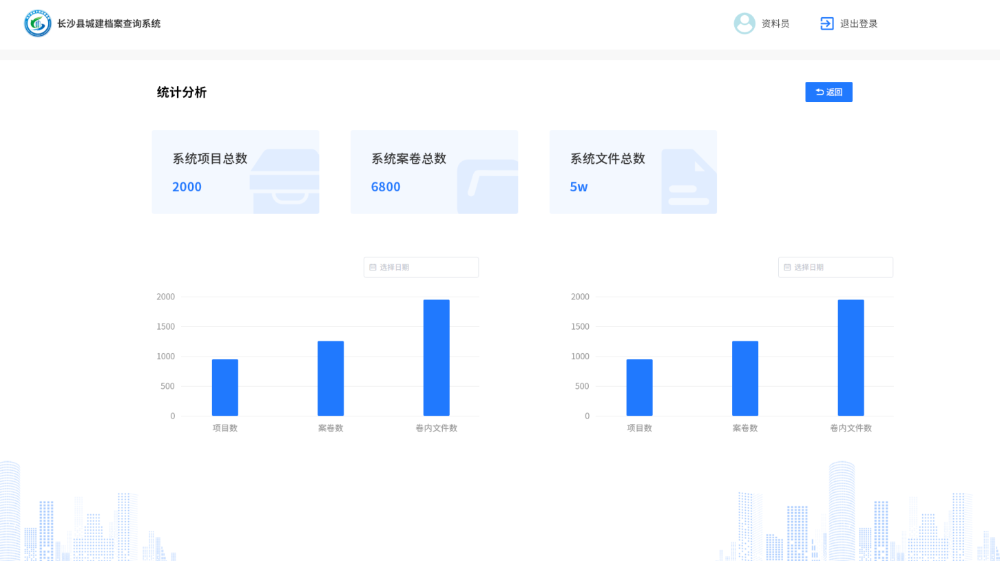

## 项目介绍

一个给城建查询档案的后台管理系统，没有依靠任何脚手架，手搓的后台架子布局。

具体档案都是施工，住建，房屋等涉密内容

只有pc端，页面内容为多层页面

> vue2+elementUI
>
> 从0到1，搭建的后台管理系统，内容较为简单，内部人员使用，只有简单的普通用户和管理员两种角色。项目周期较短，大概只有一周，后期没有改过东西了

::: tip

因为是内网项目，这里只有初版设计图，实际开发新增了一些界面内容，查询条件等

:::

|  |  |  |
| ------------------------------------------------------------ | ------------------------------------------------------------ | ------------------------------------------------------------ |
|  |  |  |

