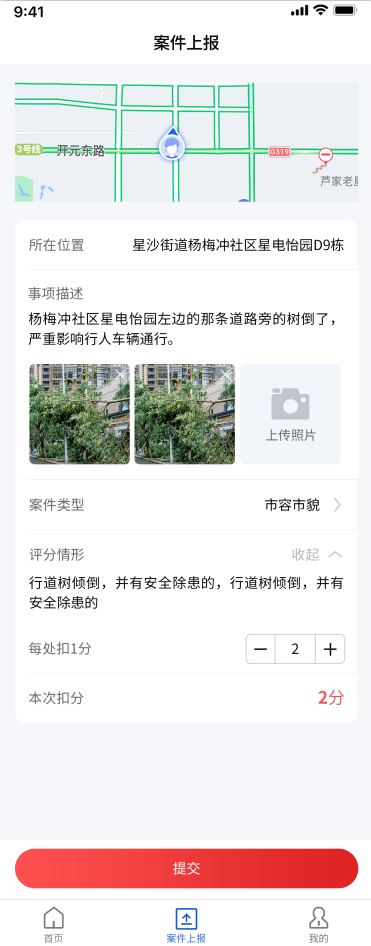
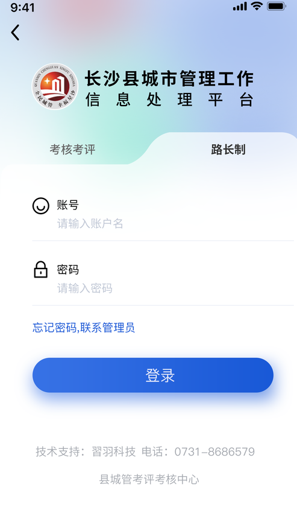
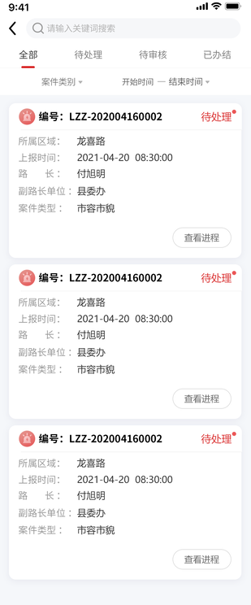
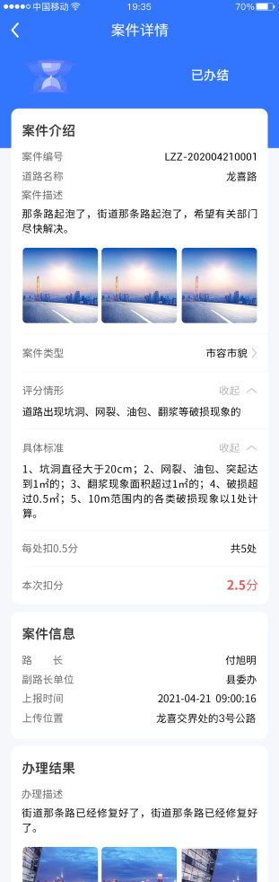
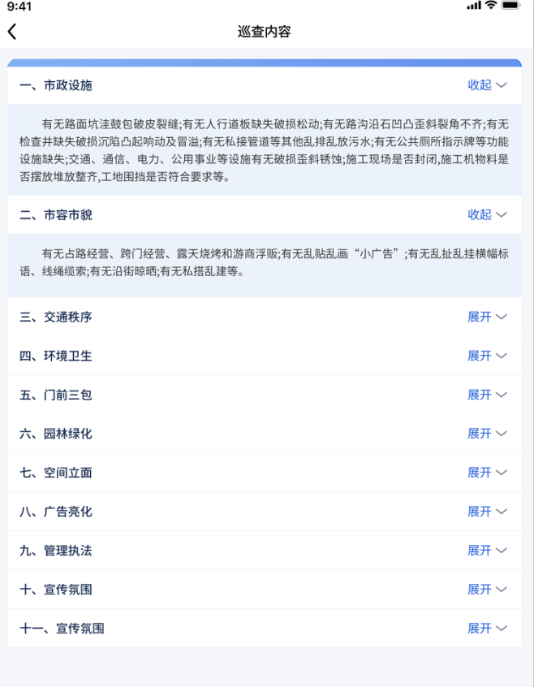

## 项目介绍

这个是做给城管局用的app，用于日常打卡，上报城市道路问题，等等

> uniapp+uView

### 路长制

原先是考核考评一个app，后面因为加了功能模块，所以叫路长制模块。

原来是**考核考评**和**路长制**，打包为一个uniapp，通过登录的type类型不同，然后自定义tabBar内容，但是由于城管局人员，既需要考核考评，又需要路长制，不想频繁地切换账号，所以分开成2个app。

路长制由考核考评改写，但是原考核考评不变。

::: tip 技术难点

由于用到了定位功能，前期在电脑上模拟测试耗费大量时间，这跟电脑设备有关，经常连不上手机，其他页面都中规中矩，手机端只是提交表单，处理表单都在电脑端后台

:::

|  |  |  |
| ------------------------------------------------------------ | ------------------------------------------------------------ | ------------------------------------------------------------ |
|  |  |  |
|                                                              |                                                              |                                                              |

