## 项目介绍

党员网，政府工作单位运营。日常发布文章、新闻等。

说简单点就是个博客网，同样也是有两个端，pc和app

### pc端

[入口，点我直达](http://www.csxdyw.gov.cn/#/index)

以模块划分的话，有2个模块

1. 文章模块
2. 视频模块

文章模块的话，就是文章详情页，和列表页，是共用的，变化的是type类型参数。

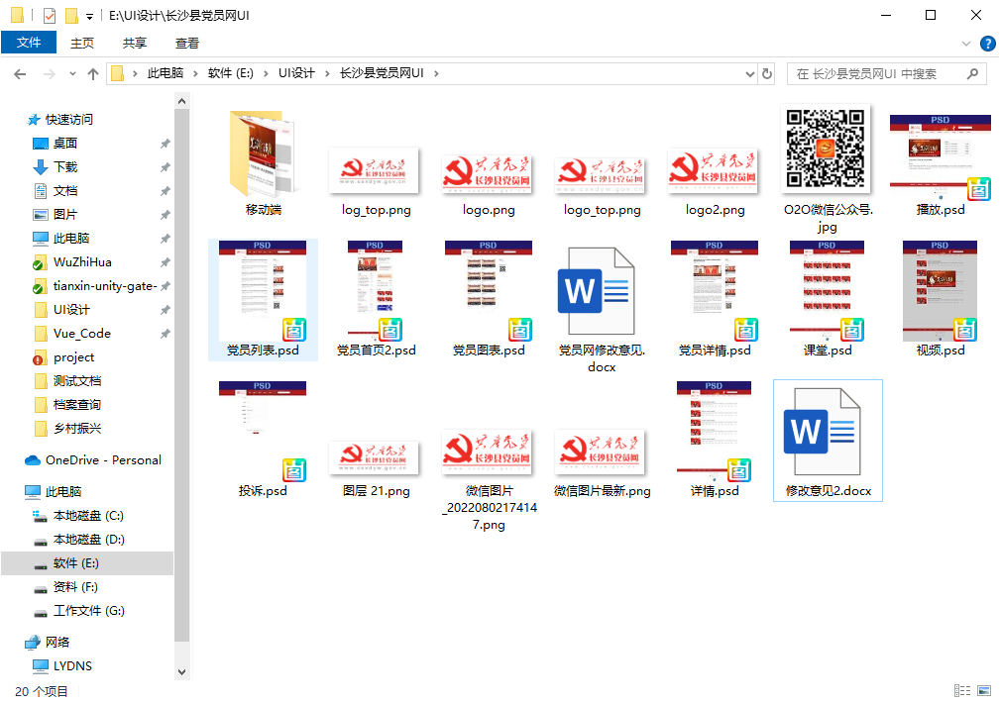

::: tip

因为设计图与实际会有出处变动，所以下面的截图，我是用的官网的

:::

#### 文章模块

::: warning 插件

项目有用到Swiper轮播图，qr-code生成二维码

:::

| 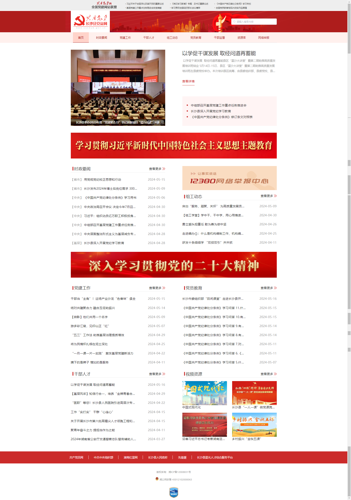 | 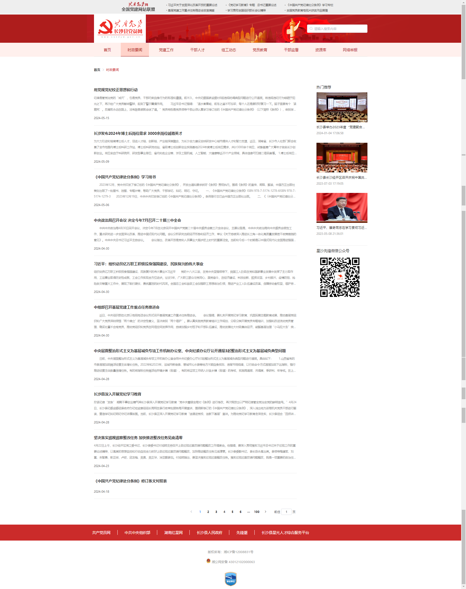 | 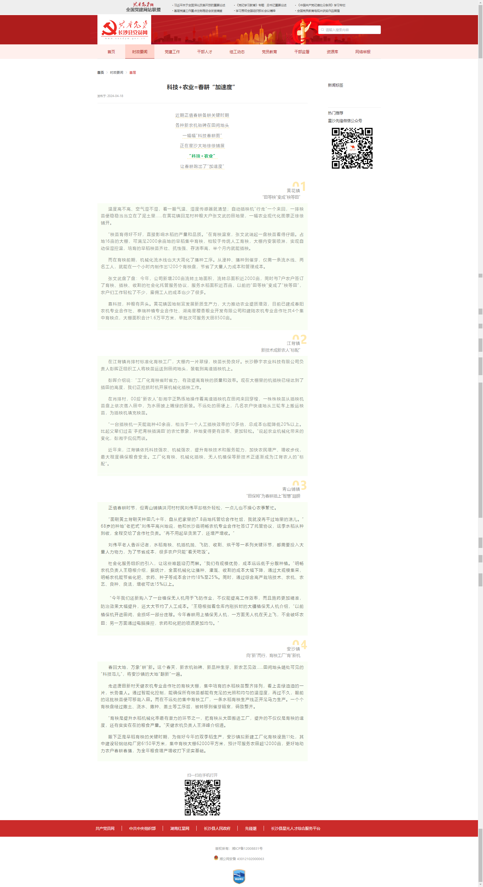 |
| ------------------------------------------------------------ | ------------------------------------------------------------ | ------------------------------------------------------------ |
| 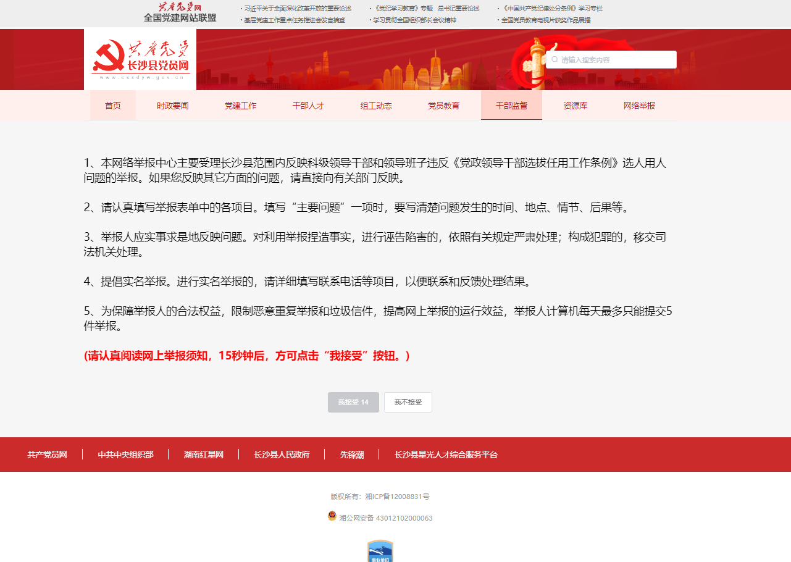 | 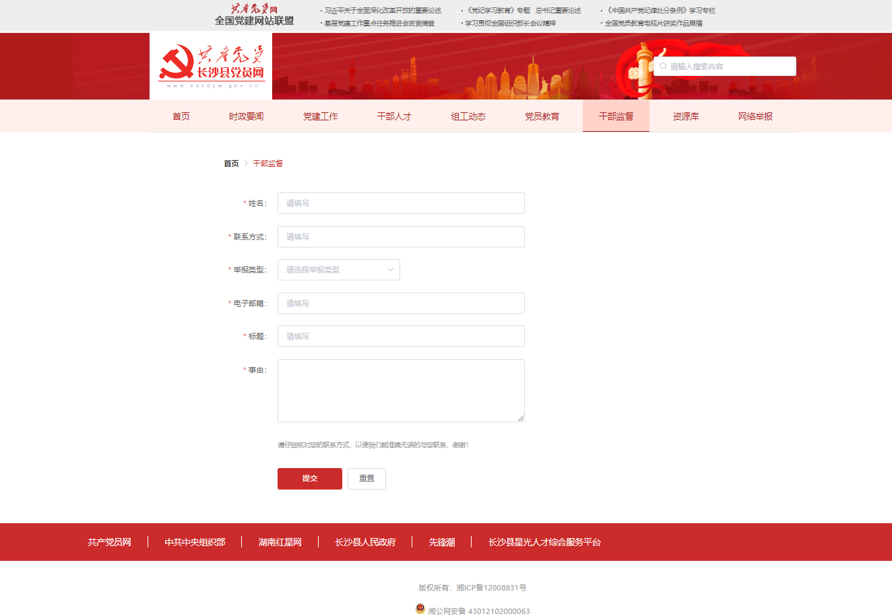 |                                                              |

#### 视频模块

| 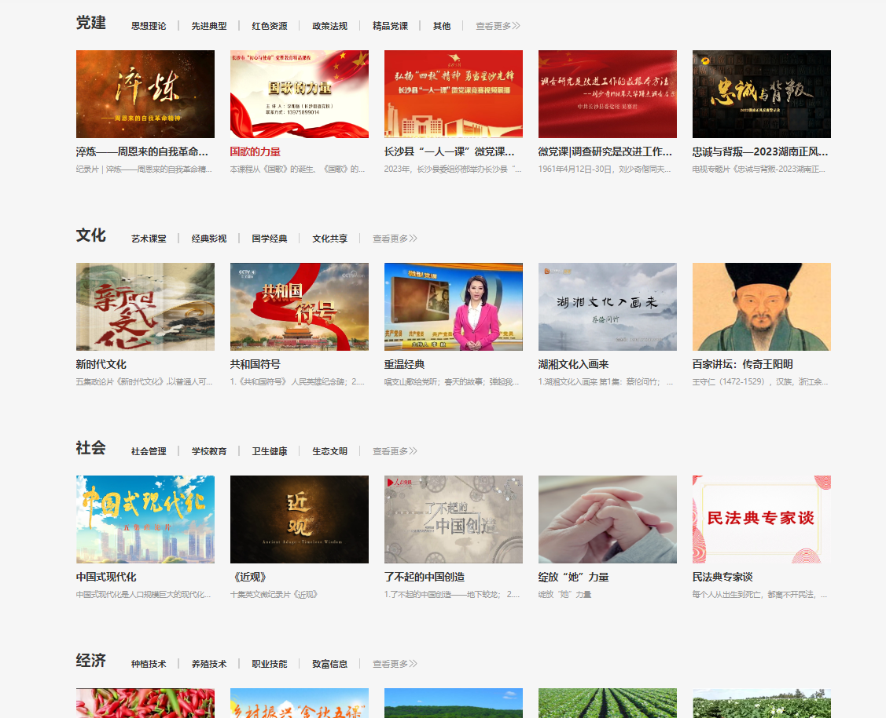 | 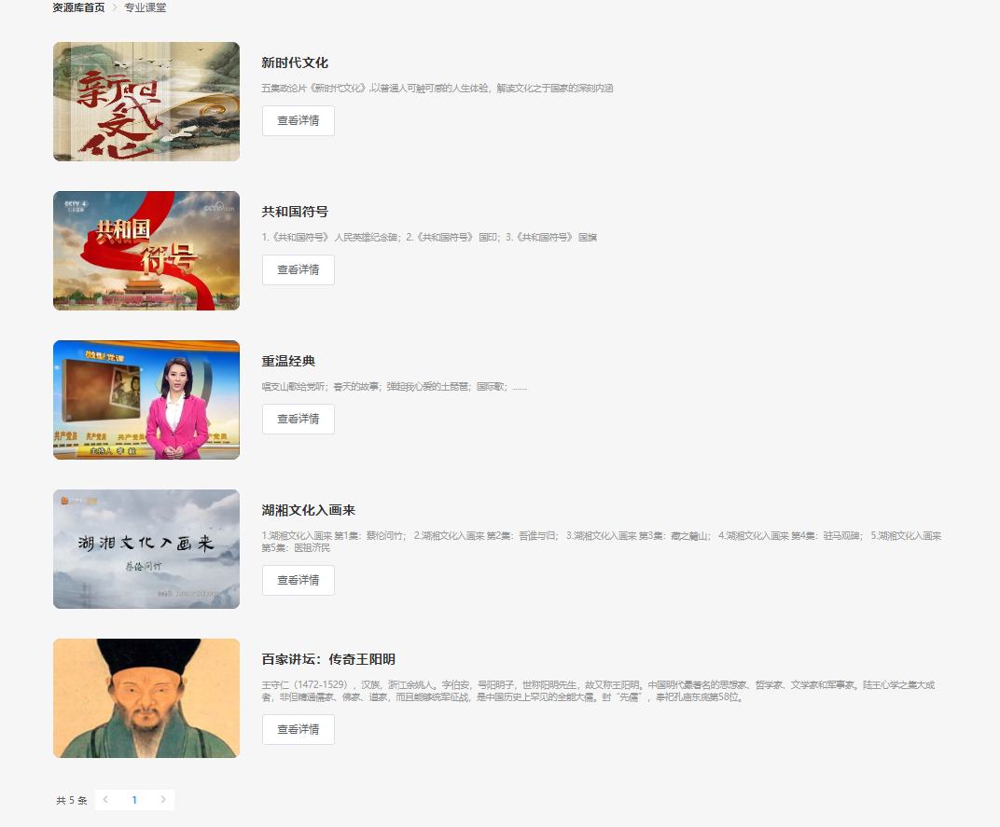 | 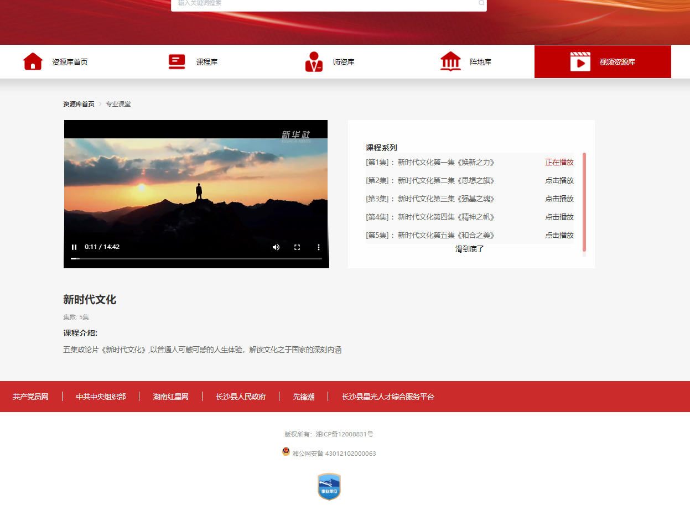 |
| ------------------------------------------------------------ | ------------------------------------------------------------ | ------------------------------------------------------------ |
|                                                              |                                                              |                                                              |

### app端

手机端扫码打开，其实pc和app链接是一样的，根据设备判断，所进入的项目不同

| 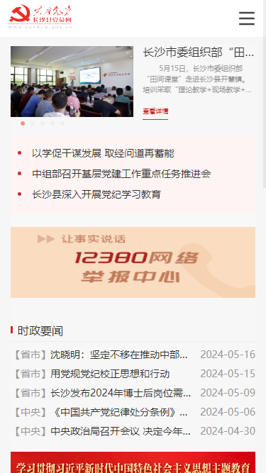 | 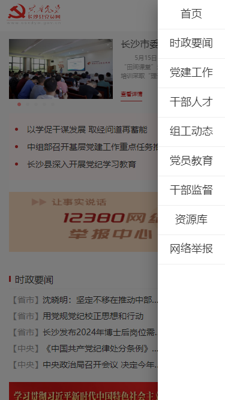 |
| ------------------------------------------------------------ | ------------------------------------------------------------ |
| 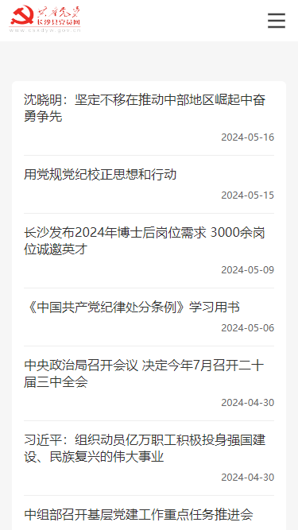 | 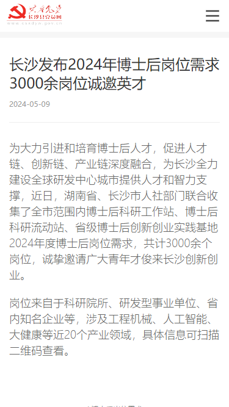 |

#### 视频模块

| 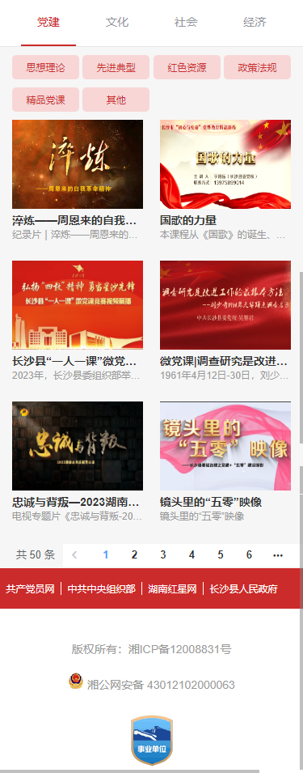 | 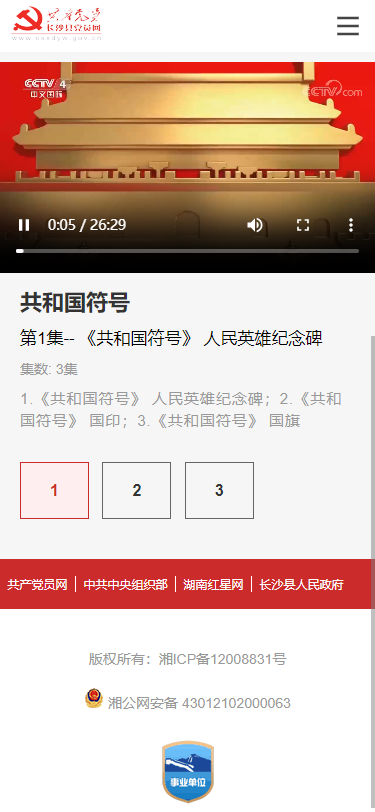 |
| ------------------------------------------------------------ | ------------------------------------------------------------ |
|                                                              |                                                              |

### 后台

后台由若依作为底层搭建，没有修改太多东西，但是根据甲方要求，不使用最新的quill富文本编辑器。

使用的是UEdior编辑器，较为古老，大概是08年那会的，百度的编辑器

具体如下

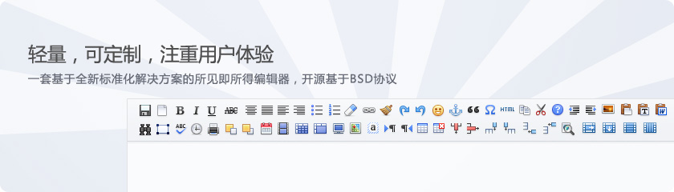

