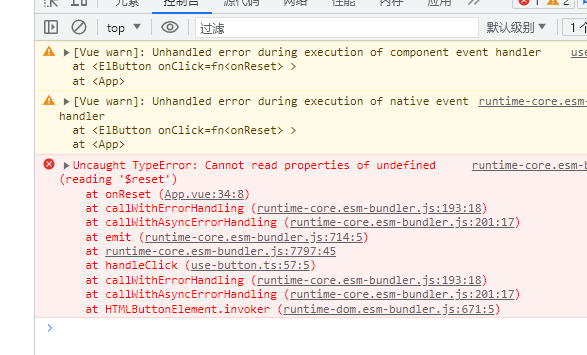
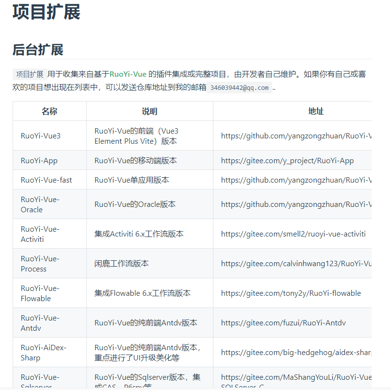

# 12-pinia缓存集成

> [pinia官网](https://pinia.vuejs.org/zh/)

## 概述

::: info

先看两种方式，就和vue3的组合式api一样

setup不能用$reset重置，要手动写，所以用option吧


:::


### 1.Option Store

与 Vue 的选项式 API 类似，我们也可以传入一个带有 `state`、`actions` 与 `getters` 属性的 Option 对象

- state，就跟vue页面中那个data变量一样
- getters，类似于computed计算属性
- actions，和methods一致

```js {2-10}
export const useCounterStore = defineStore('counter', {
  state: () => ({ count: 0 }),
  getters: {
    double: (state) => state.count * 2,
  },
  actions: {
    increment() {
      this.count++
    },
  },
})
```

### 2.Setup Store

也存在另一种定义 store 的可用语法。与 Vue 组合式 API 的 [setup 函数](https://cn.vuejs.org/api/composition-api-setup.html) 相似，我们可以传入一个函数，该函数定义了一些响应式属性和方法，并且返回一个带有我们想暴露出去的属性和方法的对象。

```js
export const useCounterStore = defineStore('counter', () => {
  const count = ref(0)
  const doubleCount = computed(() => count.value * 2)
  function increment() {
    count.value++
  }

  return { count, doubleCount, increment }
})
```

我这里用的是setup语法，根据个人习惯而定。如果是为了维护，项目过大，那就用option。如果使用pinia较少的小项目，可以用setup方式

---


## 一、安装

```shell
npm install pinia
```


## 二、配置全局引入

`main.js`

```js
// pinia
import { createPinia } from 'pinia';
const pinia = createPinia();
app.use(pinia);
// store
import store from '@/store';
app.config.globalProperties.$store = store;
```


## 三、匹配子模块

在`src`下创建`store`文件夹，然后创建`index.js`

并且新建`modules`文件夹

::: tip

通过正则来获取子模块，通常都有子模块，最好别只用一个index.js来编写所有存储变量

:::

```js
// 拿到modules下的所有文件
const modulesFiles = import.meta.globEager('./modules/*.*');
const modules = {};
for (const key in modulesFiles) {
  const moduleName = key.replace(/(.*\/)*([^.]+).*/gi, '$2');
  const value = modulesFiles[key];
  modules[moduleName] = value;
  // console.log(modules);
}

export default modules;
```


### 解决报错

如果你是vite5的话，你会跟我一样报错


::: tip

因为这是vite4的写法，翻看官方文档


[v4迁移v5的特性 -->入口](https://cn.vitejs.dev/guide/migration.html)

这里说明了，` import.meta.globEager`的`globEager`改成了`glob`

```
要加上eager属性为true,默认懒加载是false,关闭懒加载就是同步代码了. 所以要给true
```

**多看文档**

> 这里由于懒加载eager属性，为后面埋了个雷，请一步步看完，全局使用会有问题、

:::


## 四、测试

### 1.简单测试（按需使用）


::: info

这里的简单测试，指的是按需引用，就是建了modules下的子模块，然后页面上单独引入这个子模块。

我知道，在大型项目开发时。store都是挂在全局的，随时都能用，减少引入的麻烦

:::

> 例如：我这里贴个vuex的用法
>
> 


#### test.js

去对应目录创建文件`src/store/modules/test.js`

```js
import { defineStore } from 'pinia';

export const useTestStore = defineStore('test', () => {
  const count = ref(0);
  function countAdd() {
    count.value++;
  }
  return { count, countAdd };
});
```


#### `App.vue`

```html
<template>
  <h1>{{ testObj.count }}</h1>
  <el-button type="primary" @click="onClick">点击</el-button>
</template>

<script setup>
import { useTestStore } from '@/store/modules/test';
const testObj = useTestStore();

function onClick() {
  return testObj.countAdd();
}
</script>

```

如果页面点击可以添加，说明调用成功了。

---

这里再进行改写，把testObj.count赋值到本页面中，

::: tip 为什么不用直接赋值? let count = testObj.count

使用toRefs是为了不丢失响应性

:::


```html
<template>
  <h1>{{ testObj.count }}</h1>  // [!code --]
  <h1>{{ count }}</h1> // [!code ++]
  <el-button type="primary" @click="onClick">点击</el-button>
</template>

<script setup>
import { useTestStore } from '@/store/modules/test';
const testObj = useTestStore();
let { count } = toRefs(testObj); // [!code ++]
let { countAdd } = testObj; // [!code ++]

function onClick() {
  return testObj.countAdd(); // [!code --]
  return countAdd();// [!code ++]
}
</script>

```

> 其实可以省掉const testObj = useTestStore(); 


### 2.复杂测试（挂载全局）

`main.js`

```js
import store from '@/store';
app.config.globalProperties.$store = store;
```

这里挂载到main.js，跟vue2的 `Vue.prototype.$store= store`道理一样


#### App.vue

> > > > 很奇怪，我用的vite5，跟教程作者用vite4大相径庭。用法不一样
> > > >
> > > > 看区别

他的代码

```
<template>
  <h1>{{ count }}</h1>
  <button @click="handleClick">click</button>
  <br />
  <h1>{{ $store.test.useTestStore().count }}</h1>
  <button @click="$store.test.useTestStore().countAdd">click</button>
</template>

<script setup>
const { proxy } = getCurrentInstance();
let useTestStore = proxy.$store.test.useTestStore();
let { count } = toRefs(useTestStore); // 响应式
let { countAdd } = useTestStore;

function handleClick() {
  countAdd();
}
</script>

```

::: warning 我会报错，就很奇怪

但是我把proxy.$store.test单独拿出来。

```js {5}
proxy.$store.test().then((res) => {
  let { count } = res.useTestStore();
  console.log(`count -->`, count);
});
// 写成这样又可以,我一直找不到哪里导致异步
```


:::

我服啦，我差不多找了一个半小时原因。


::: tip 原因就是vite5的glob是异步的，开启这个属性就可以了


:::

因为原作者他是vite4，使用的是`globEager`，我早该看到的为啥会简化为glob，单独分出来懒加载为eager属性

> 

所以修改`src/store/index.js`

```js
const modulesFiles = import.meta.glob('./modules/*.*', { eager: true });
```


## 五、pinia持久化插件

[插件官网](https://prazdevs.github.io/pinia-plugin-persistedstate/zh/)

### [概述](https://prazdevs.github.io/pinia-plugin-persistedstate/zh/guide/#概述)

本插件兼容 `pinia^2.0.0`，在使用之前请确保你已经 [安装 Pinia](https://pinia.vuejs.org/zh/getting-started.html)。 `pinia-plugin-persistedstate` 丰富的功能可以使 Pinia Store 的持久化更易配置：

- 与 [`vuex-persistedstate`](https://github.com/robinvdvleuten/vuex-persistedstate) 相似的 API
- 所有 Store 均可单独配置
- 自定义 storage 和数据序列化
- 恢复持久化数据前后的 hook
- 每个 Store 具有丰富的配置
- 兼容 Vue 2 和 3
- 无任何外部依赖

### 1.安装

::: code-group

```shell [pnpm]
pnpm i pinia-plugin-persistedstate
```

```shell [npm]
npm i pinia-plugin-persistedstate
```

```shell [yarn]
yarn add pinia-plugin-persistedstate
```

:::


`main.js`

```js
// pinia持久化存储
import { createPersistedState } from 'pinia-plugin-persistedstate';
pinia.use(
  createPersistedState({
    auto: true, // 启用所有 Store 默认持久化
  }),
);
```

> 


::: info

~~pinia持久化的无法通过 `window.localStorage.clear();` 一键清空数据~~

经测试我可以清空

如果不能通过那个语句清空

[请看原文](https://gitee.com/zhengqingya/java-developer-document/blob/master/%E7%9F%A5%E8%AF%86%E5%BA%93/%E5%89%8D%E7%AB%AF/03-%E2%98%86%E5%AE%9E%E6%88%98%E9%A1%B9%E7%9B%AE%E2%98%86/web%E9%A1%B9%E7%9B%AE%E5%AE%9E%E6%88%98/02-%E3%80%90%E7%AC%AC%E4%BA%8C%E7%89%88%E3%80%91vue3+vite4/small-web/doc/11-Pinia.md#tips-pinia%E6%8C%81%E4%B9%85%E5%8C%96%E7%9A%84%E6%97%A0%E6%B3%95%E9%80%9A%E8%BF%87-windowlocalstorageclear-%E4%B8%80%E9%94%AE%E6%B8%85%E7%A9%BA%E6%95%B0%E6%8D%AE)

:::


### 2.重置state

::: tip

 同样的，重置的时候也有区别，option和setup两种不一样

:::

- 使用`option` [选项式 API](https://pinia.vuejs.org/zh/core-concepts/#option-stores) 时，你可以通过调用 store 的 `$reset()` 方法将 state 重置为初始值。

```js
const store = useStore()

store.$reset()
```


- 在 [Setup Stores](https://pinia.vuejs.org/core-concepts/#setup-stores) 中，您需要创建自己的 `$reset()` 方法：

案例

```js
export const useCounterStore = defineStore('counter', () => {
  const count = ref(0)

  function $reset() {
    count.value = 0
  }

  return { count, $reset }
})
```


我是setup方式，然后我直接用`this.$reset()`，会报错




解决：

1. 改用选项式api
2. 重写 $reset 方法


## 总结

我翻看了若依vite+vue3的项目源码，发现若依大佬是option的写法

所以，pinia还是用option吧，这篇学会简单用法即可

[若依vue3后台管理系统源码](https://github.com/yangzongzhuan/RuoYi-Vue3/blob/master/src/store/modules/dict.js)


[若依项目扩展](http://doc.ruoyi.vip/ruoyi-vue/document/xmkz.html#后台扩展)

> 
