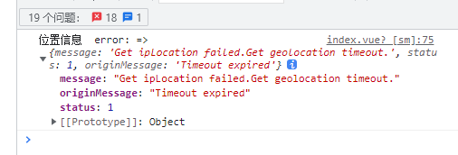

# 01-简易实现页面展示

vue3+vite5+js+element plus+pinia

::: tip

[vue2请看](https://blog.csdn.net/qq_51055690/article/details/133894962)

这是我在csdn的文章

:::

## 一、安装

```shell
npm i @amap/amap-jsapi-loader --save
```

## 二、配置

`main.js`

```js
// 高德地图
window._AMapSecurityConfig = {
  securityJsCode: '', //*  安全密钥
};
app.config.globalProperties.mapJsKey = ''; // key
```


## 三、页面

路由自己去设置了，我这里贴出来vue页面代码

### template

```html
<template>
  <div class="app-container flex-center-center">
    <div id="Map" class="map"></div>
  </div>
</template>
```


### script 

#### 引入

```js
import AMapLoader from '@amap/amap-jsapi-loader';
import { getCurrentInstance, ref, reactive } from 'vue';
```

#### 变量

```js
const map = ref(null); // 地图实例
const geolocation = ref(null); // 定位实例
const position = ref([]); // 坐标
const data = reactive({
  form: {},
  locationInfo: {},
});
const { locationInfo } = toRefs(data);
const { proxy } = getCurrentInstance();
```

#### 方法

这里我解释下

- map和geolocation是实例对象，就跟swiper、echarts生成的那种实例对象一样。
- position是ref生成，所以都有.value，至于locationInfo为啥要用toRefs解构，因为要保持响应性，所以我都加了.value来赋值，取值也是一样的
- `proxy`是用来获取main.js中挂载全局的key值的，我推荐挂在全局，万一有多个页面使用也方便
- 在script标签内最后运行一下。initMap()就好了

::: tip

后续会把AMap也写成ref变量来使用，分模块化

:::

```js
function initMap() {
  AMapLoader.load({
    key: proxy.mapJsKey, // 申请好的Web端开发者Key，首次调用 load 时必填
    //2.0版本太卡了 ，所以使用的1.4.0版本  其插件也有不同  如：ToolBar
    version: '2.0', // 指定要加载的 JSAPI 的版本，缺省时默认为 1.4.15
    resizeEnable: true, // 定位到当前位置
    plugins: [
      'AMap.ToolBar', //工具条
      'AMap.Geolocation', //定位
      'AMap.PlaceSearch', // poi搜索
      'AMap.Scale', // 比例尺
    ], // 需要使用的的插件列表，如比例尺'AMap.Scale'等
  })
    .then((AMap) => {
      map.value = new AMap.Map('Map', {
        viewMode: '3D', //是否为3D地图模式
        zoom: 14, //初始化地图级别
      });
      map.value.addControl(new AMap.ToolBar()); // 工具条
      map.value.addControl(new AMap.Scale()); // 比例尺

      geolocation.value = new AMap.Geolocation({
        //定位
        enableHighAccuracy: true, //是否使用高精度定位，默认:true
        timeout: 5000, //超过10秒后停止定位，默认：无穷大
        maximumAge: 0, //定位结果缓存0毫秒，默认：0
        convert: true, //自动偏移坐标，偏移后的坐标为高德坐标，默认：true
        showButton: true, //显示定位按钮，默认：true
        buttonPosition: 'RB', //定位按钮停靠位置，默认：'LB'，左下角
        buttonOffset: new AMap.Pixel(60, 20), //定位按钮与设置的停靠位置的偏移量，默认：Pixel(10, 20)
        showMarker: true, //定位成功后在定位到的位置显示点标记，默认：true
        showCircle: true, //定位成功后用圆圈表示定位精度范围，默认：true
        panToLocation: true, //定位成功后将定位到的位置作为地图中心点，默认：true
        zoomToAccuracy: true, //定位成功后调整地图视野范围使定位位置及精度范围视野内可见，默认：false
      });
      map.value.addControl(geolocation.value); //在地图上引入定位插件

      geolocation.value.getCurrentPosition((status, result) => {
        if (status == 'complete') {
          locationInfo.value = result;
          // console.log('位置信息  complete: => ', result);
          // console.log('位置经纬度: => ', result.position);
          position.value = [result.position.lng, result.position.lat];
        } else {
          console.log('位置信息  error: =>', result);
        }
      });
    })
    .catch((e) => {
      console.log(e);
    });
}
initMap();
```

样式

```
<style lang="scss" scoped>
.app-container {
  padding: 30px;
  .map {
    width: 800px;
    height: 400px;
    border: 1px solid #000;
  }
}
</style>
```


## 四、伸手党

### main.js

```js
// 高德地图
window._AMapSecurityConfig = {
  securityJsCode: '', //*  安全密钥
};
app.config.globalProperties.mapJsKey = ''; // key
```

### test.vue

```html
<template>
  <div class="app-container flex-center-center">
    <div id="Map" class="map"></div>
  </div>
</template>

<script setup>
import AMapLoader from '@amap/amap-jsapi-loader';
import { getCurrentInstance, ref, reactive } from 'vue';

const map = ref(null); // 地图实例
const geolocation = ref(null); // 定位实例
const position = ref([]); // 坐标
const data = reactive({
  form: {},
  locationInfo: {},
});
const { locationInfo } = toRefs(data);
const { proxy } = getCurrentInstance();

function initMap() {
  AMapLoader.load({
    key: proxy.mapJsKey, // 申请好的Web端开发者Key，首次调用 load 时必填
    //2.0版本太卡了 ，所以使用的1.4.0版本  其插件也有不同  如：ToolBar
    version: '2.0', // 指定要加载的 JSAPI 的版本，缺省时默认为 1.4.15
    resizeEnable: true, // 定位到当前位置
    plugins: [
      'AMap.ToolBar', //工具条
      'AMap.Geolocation', //定位
      'AMap.PlaceSearch', // poi搜索
      'AMap.Scale', // 比例尺
    ], // 需要使用的的插件列表，如比例尺'AMap.Scale'等
  })
    .then((AMap) => {
      map.value = new AMap.Map('Map', {
        viewMode: '3D', //是否为3D地图模式
        zoom: 14, //初始化地图级别
      });
      map.value.addControl(new AMap.ToolBar()); // 工具条
      map.value.addControl(new AMap.Scale()); // 比例尺

      geolocation.value = new AMap.Geolocation({
        //定位
        enableHighAccuracy: true, //是否使用高精度定位，默认:true
        timeout: 5000, //超过10秒后停止定位，默认：无穷大
        maximumAge: 0, //定位结果缓存0毫秒，默认：0
        convert: true, //自动偏移坐标，偏移后的坐标为高德坐标，默认：true
        showButton: true, //显示定位按钮，默认：true
        buttonPosition: 'RB', //定位按钮停靠位置，默认：'LB'，左下角
        buttonOffset: new AMap.Pixel(60, 20), //定位按钮与设置的停靠位置的偏移量，默认：Pixel(10, 20)
        showMarker: true, //定位成功后在定位到的位置显示点标记，默认：true
        showCircle: true, //定位成功后用圆圈表示定位精度范围，默认：true
        panToLocation: true, //定位成功后将定位到的位置作为地图中心点，默认：true
        zoomToAccuracy: true, //定位成功后调整地图视野范围使定位位置及精度范围视野内可见，默认：false
      });
      map.value.addControl(geolocation.value); //在地图上引入定位插件

      geolocation.value.getCurrentPosition((status, result) => {
        if (status == 'complete') {
          locationInfo.value = result;
          // console.log('位置信息  complete: => ', result);
          // console.log('位置经纬度: => ', result.position);
          position.value = [result.position.lng, result.position.lat];
        } else {
          console.log('位置信息  error: =>', result);
        }
      });
    })
    .catch((e) => {
      console.log(e);
    });
}

initMap();
</script>

<style lang="scss" scoped>
.app-container {
  padding: 30px;
  .map {
    width: 800px;
    height: 400px;
    border: 1px solid #000;
  }
}
</style>
```

## 五、页面效果


因为我挂了梯子所以，我显示在国外


应该大部分人的电脑，windows没有gps定位模块，会显示不出来


浏览器会报错`定位超时`



把地址生成二维码，手机在同一wifi下，扫码并用系统浏览器打开。

允许定位

就可以获取到位置信息了。

::: tip

隐私，所以不透露在哪了，手机定位很精确的

:::

> 