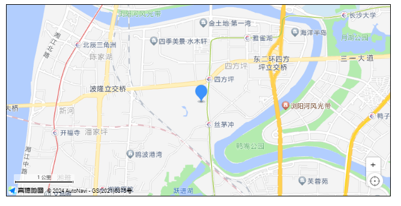
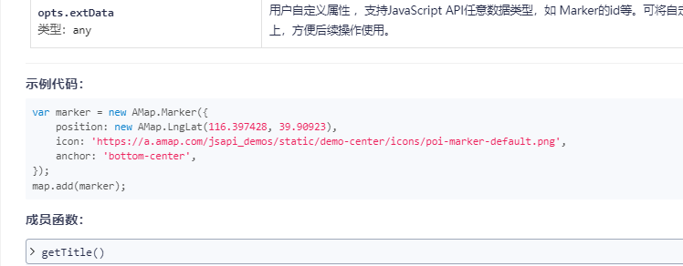
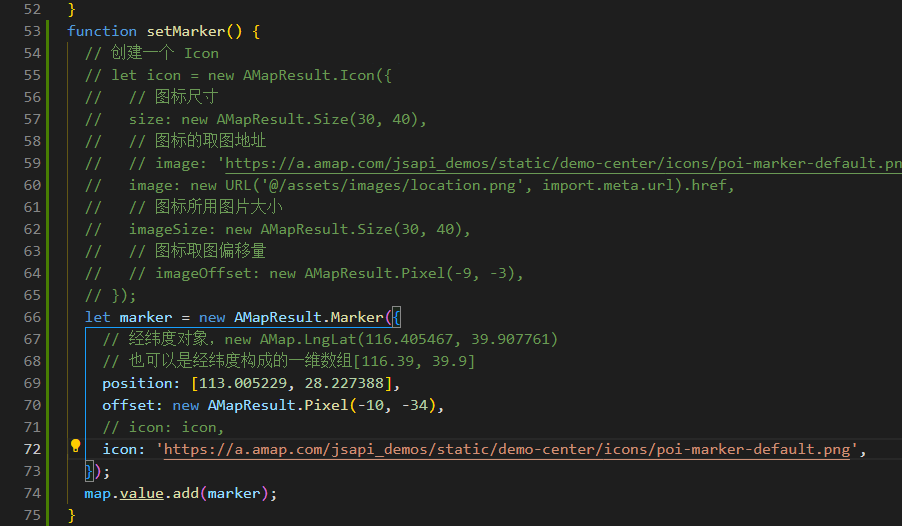
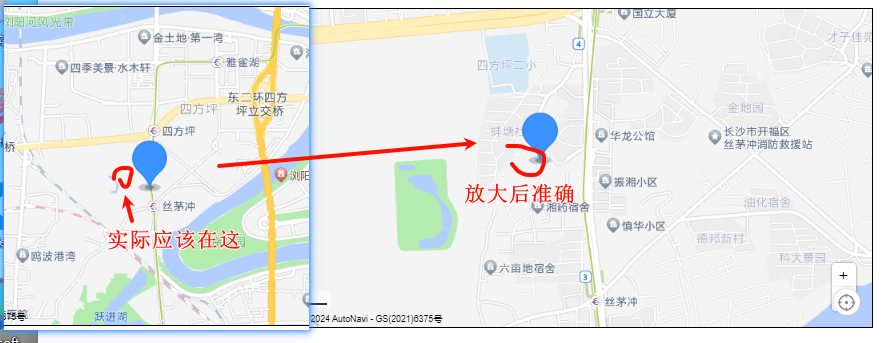
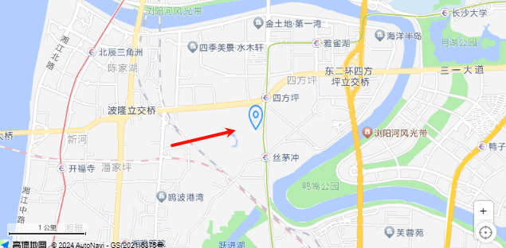
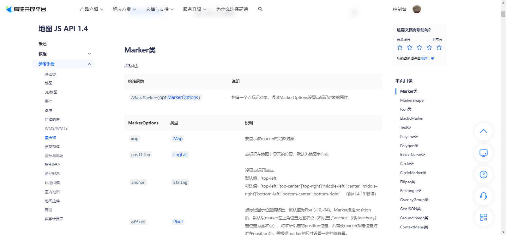
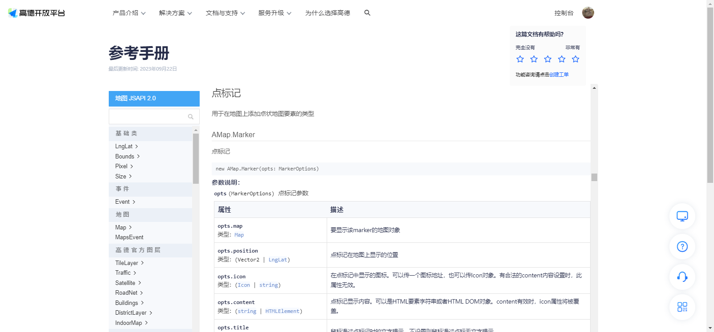
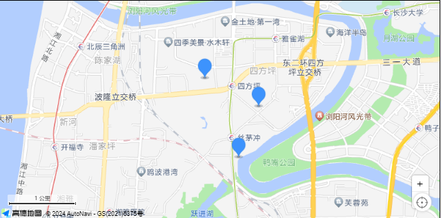
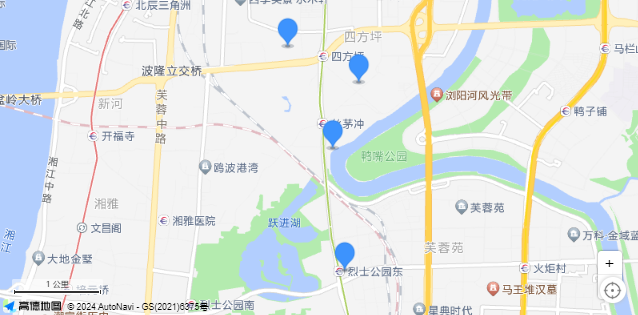

# 03-添加点标记

2024年1月25日11:34:39

[官方文档](https://lbs.amap.com/api/javascript-api-v2/tutorails/add-marker)

## 一、官方教程

### 1.1 创建地图

```js
const map = new AMap.Map("container", {
  viewMode: "2D", //默认使用 2D 模式
  zoom: 11, //地图级别
  center: [116.397428, 39.90923], //地图中心点
});
```

### 1.2 自定义`Marker`

`Marker`实例的内容content是可以自定义的，content属性值是字符串拼接的 DOM 元素。

```js
//点标记显示内容
const markerContent = `<div class="custom-content-marker">

<div class="close-btn" onclick="clearMarker()">X</div>
</div>`
```

自定义内容的样式

```css
.custom-content-marker {
  position: relative;
  width: 25px;
  height: 34px;
}

.custom-content-marker img {
  width: 100%;
  height: 100%;
}

.custom-content-marker .close-btn {
  position: absolute;
  top: -6px;
  right: -8px;
  width: 15px;
  height: 15px;
  font-size: 12px;
  background: #ccc;
  border-radius: 50%;
  color: #fff;
  text-align: center;
  line-height: 15px;
  box-shadow: -1px 1px 1px rgba(10, 10, 10, .2);
}

.custom-content-marker .close-btn:hover{
  background: #666;
}
```

### 1.3 创建Marker对象

::: tip 提示

如果不知道如何确认经纬度前往 [拾取坐标](https://lbs.amap.com/tools/picker)

:::

```js
const position = new AMap.LngLat(116.397428, 39.90923); //Marker 经纬度
const marker = new AMap.Marker({
  position: position,
  content: markerContent, //将 html 传给 content
  offset: new AMap.Pixel(-13, -30), //以 icon 的 [center bottom] 为原点
});
```

### 1.4 将Marker添加到地图上

```js
 map.add(marker);
```

### 1.5 给Marker绑定事件

```js
function clearMarker() {
  map.remove(marker); //清除 marker
}
document.querySelector(".close-btn").onclick = clearMarker; //绑定点击事件
```

::: tip

将Marker从地图上移除：map.remove(marker)。

:::


## 二、我的Vue教程

保姆级教程，每一步都亲自测试过 ，只要cv就能学会

### 初始化页面

```js
import AMapLoader from '@amap/amap-jsapi-loader';
import { getCurrentInstance, ref, reactive } from 'vue';

const map = ref(null); // 地图实例
const { proxy } = getCurrentInstance();
let AMapResult = null; // 不需要响应性,用于保存模块化 // [!code ++]

function initMap() {
  AMapLoader.load({
    key: proxy.mapJsKey, // 申请好的Web端开发者Key，首次调用 load 时必填
    version: '2.0', // 指定要加载的 JSAPI 的版本，缺省时默认为 1.4.15
    resizeEnable: true, // 定位到当前位置
    plugins: [
      'AMap.ToolBar', // 缩放控件
      'AMap.Scale', // 比例尺
      'AMap.Geolocation', // 定位控件
    ], // 需要使用的的插件列表，如比例尺'AMap.Scale'等
  })
    .then((AMap) => {
      AMapResult = AMap;// 用于拆分模块化 // [!code ++]
      map.value = new AMap.Map('Map', {
        viewMode: '3D', //是否为3D地图模式
        zoom: 14, //初始化地图级别
        center: [113.005229, 28.227388],
      });
      map.value.addControl(new AMap.ToolBar()); // 工具条
      map.value.addControl(new AMap.Scale()); // 比例尺
      map.value.addControl(new AMap.Geolocation()); // 定位控件
    })
    .catch((e) => {
      console.log(e);
    });
}

initMap();
```

### 2.1 添加单个marker

```js {3}
    ...
    .then((AMap) => {
      AMapResult = AMap;
      map.value = new AMapResult.Map('Map', {
        viewMode: '3D', //是否为3D地图模式
        zoom: 14, //初始化地图级别
        center: [113.005229, 28.227388],
      });
      map.value.addControl(new AMapResult.ToolBar()); // 工具条
      map.value.addControl(new AMapResult.Scale()); // 比例尺
      map.value.addControl(new AMapResult.Geolocation()); // 定位控件

      setMarker(); // [!code ++]
    })
    .catch((e) => {
      console.log(e);
    });
```

添加`图标`类型的点标记

```js {16}
function setMarker() {
  // 创建一个 Icon
  let icon = new AMapResult.Icon({
    // 图标尺寸
    size: new AMapResult.Size(30, 40),
    // 图标的取图地址
    image: 'https://a.amap.com/jsapi_demos/static/demo-center/icons/poi-marker-default.png',
    // 图标所用图片大小
    imageSize: new AMapResult.Size(30, 40),
    // 图标取图偏移量
    // imageOffset: new AMapResult.Pixel(-9, -3),
  });
  let marker = new AMapResult.Marker({
    // 经纬度对象，new AMap.LngLat(116.405467, 39.907761)
    // 也可以是经纬度构成的一维数组[116.39, 39.9]
    position: [113.005229, 28.227388], // [!code warning]
    offset: new AMapResult.Pixel(-10, -34),
    icon: icon,
  });
  map.value.add(marker);
}
```

这里我是把中心点作为图标加入到map中，如果操作都没有失误，那么看你的预览，应该如下



### 官方教程的简易版添加单个标记

[传送门](https://lbs.amap.com/api/javascript-api-v2/documentation#marker)



```js
var marker = new AMap.Marker({
    position: new AMap.LngLat(116.397428, 39.90923),
    icon: 'https://a.amap.com/jsapi_demos/static/demo-center/icons/poi-marker-default.png',
    anchor: 'bottom-center',
});
map.add(marker);
```


> 

我这里不用自定义icon，直接把icon换成超链接

页面的图标有点偏，凑合用吧，放大就准确了，不过图片很大，不太美观，我推荐自定义icon



缩放的时候有点离谱

这是没有自定义icon的，icon可以直接用图片超链接，也可以import导入

我这里为了测试效果，换一张图片


```js
// 创建一个 Icon
let icon = new AMapResult.Icon({
  // 图标尺寸
  size: new AMapResult.Size(30, 40),
  // 图标的取图地址
  // image: 'https://a.amap.com/jsapi_demos/static/demo-center/icons/poi-marker-default.png', // [!code --]
  image: new URL('@/assets/images/location.png', import.meta.url).href, // [!code ++]
  // 图标所用图片大小
  imageSize: new AMapResult.Size(30, 40),
  // 图标取图偏移量
  // imageOffset: new AMapResult.Pixel(-9, -3),
});
```

::: info  vite引入静态资源的方式与vue2不同

[传送门](https://cn.vitejs.dev/guide/assets#new-url-url-import-meta-url)

```js
// 用法案例
const imgUrl = new URL('./img.png', import.meta.url).href
document.getElementById('hero-img').src = imgUrl

// vue2用法
image: require('@/assets/images/qinglian/jidi.png'), // [!code --]
```

:::



图片被扭曲这是因为设置了图片所用大小，

修改`imageSize: new AMapResult.Size(30, 40),`

`size: new AMapResult.Size(30, 40),`

修改了使用大小和图片大小，还要修改偏移量，很容易对不齐。这个自测了。

[点标记锚点位置，偏移量示例文档](https://lbs.amap.com/api/javascript-api-v2/guide/amap-marker/marker-anchor-offset)


::: tip 如果有不会的，可以去看官方文档

官方文档有1.4和2.0两个不同的版本，我个人还是喜欢1.4版本的，但是教程这里我也开始学2.0的用法


:::

| 1.4版本                                                      | 2.0版本                                                      |
| ------------------------------------------------------------ | ------------------------------------------------------------ |
|  |  |

两个文档的画风不同，我个人觉得，还是用新的，新的文档虽然难看懂，但是看懂了，读1.4版就是信手拈来

### 2.2 批量添加marker标记

> 在遇到列表请求，有多个经纬度的时候，我们需要批量添加点标记

#### 模拟数据

```js
// 皆来自于我手动点击获取的,网上都是开源随便都能看到经纬度的
// 看后面
```

#### 创建变量

```js
const list = ref([]);
```

#### 完整方法

修改initMap里面点标记方法为获取列表

点标记在获取列表后再执行

```js
  	  ...
	  map.value.addControl(new AMapResult.ToolBar()); // 工具条
      map.value.addControl(new AMapResult.Scale()); // 比例尺
      map.value.addControl(new AMapResult.Geolocation()); // 定位控件

      setMarker(); // [!code --]
	  getList(); // [!code ++]
    })
    .catch((e) => {
      console.log(e);
    });
```

获取数据，

```js {30}
function getList() {
  let testList = [
    {
      longitude: 113.009312,
      latitude: 28.20836,
      name: '瑞丰家园',
      desc: '湖南省长沙市芙蓉区湘湖街道楚源茶社台球瑞丰家园',
    },
    {
      longitude: 113.007802,
      latitude: 28.221181,
      name: '通信建设有限公司',
      desc: '湖南省长沙市开福区四方坪街道湖南省通信建设有限公司',
    },
    {
      longitude: 113.010891,
      latitude: 28.228139,
      name: '金地园',
      desc: '湖南省长沙市开福区四方坪街道金地园',
    },
    {
      longitude: 113.002499,
      latitude: 28.231985,
      name: '万煦园',
      desc: '湖南省长沙市开福区伍家岭街道万煦园',
    },
  ];
  setTimeout(() => {
    list.value = testList;
    setMarker(); 
  }, 1000);
}
```

#### 修改标记方法

::: tip

其实加个forEach循环就好了

:::

```js
function setMarker() {
  // 创建一个 Icon
  let icon = new AMapResult.Icon({
    // 图标尺寸
    size: new AMapResult.Size(30, 40),
    // 图标的取图地址
    image: 'https://a.amap.com/jsapi_demos/static/demo-center/icons/poi-marker-default.png',
    // image: new URL('@/assets/images/location.png', import.meta.url).href,
    // 图标所用图片大小
    imageSize: new AMapResult.Size(30, 40),
    // 图标取图偏移量
    // imageOffset: new AMapResult.Pixel(-9, -3),
  });
  list.value.forEach((item) => { // [!code ++]
    let marker = new AMapResult.Marker({
      // 经纬度对象，new AMap.LngLat(116.405467, 39.907761)
      // 也可以是经纬度构成的一维数组[116.39, 39.9]
      position: [item.longitude, item.latitude], // [!code warning]
      offset: new AMapResult.Pixel(-10, -34),
      icon: icon,
    });
    map.value.add(marker);
  }); // [!code ++]
}
```

#### 预览效果



有没有发现，我数组有4个，还有一个呢？


> 把所有点显示在窗口内

```js
  list.value.forEach((item) => {
    let marker = new AMapResult.Marker({
      // 经纬度对象，new AMap.LngLat(116.405467, 39.907761)
      // 也可以是经纬度构成的一维数组[116.39, 39.9]
      position: [item.longitude, item.latitude],
      offset: new AMapResult.Pixel(-10, -34),
      icon: icon,
    });
    map.value.add(marker);
  });
  map.value.setFitView(); // [!code ++]
```




## 三、成品代码

::: info

成品是批量添加，改为添加单个，去掉forEach循环即可

:::

```html
<template>
  <div class="app-container flex-center-center">
    <div id="Map" class="map"></div>
  </div>
</template>

<script setup>
import AMapLoader from '@amap/amap-jsapi-loader';
import { getCurrentInstance, ref, reactive } from 'vue';

const map = ref(null); // 地图实例
const { proxy } = getCurrentInstance();
const list = ref([]);
let AMapResult = null;

function initMap() {
  AMapLoader.load({
    key: proxy.mapJsKey, // 申请好的Web端开发者Key，首次调用 load 时必填
    version: '2.0', // 指定要加载的 JSAPI 的版本，缺省时默认为 1.4.15
    resizeEnable: true, // 定位到当前位置
    plugins: [
      'AMap.ToolBar', // 缩放控件
      'AMap.Scale', // 比例尺
      'AMap.Geolocation', // 定位控件
    ], // 需要使用的的插件列表，如比例尺'AMap.Scale'等
  })
    .then((AMap) => {
      AMapResult = AMap;
      map.value = new AMapResult.Map('Map', {
        viewMode: '3D', //是否为3D地图模式
        zoom: 14, //初始化地图级别
        center: [113.005229, 28.227388],
      });
      map.value.addControl(new AMapResult.ToolBar()); // 工具条
      map.value.addControl(new AMapResult.Scale()); // 比例尺
      map.value.addControl(new AMapResult.Geolocation()); // 定位控件

      getList();
    })
    .catch((e) => {
      console.log(e);
    });
}
function getList() {
  let testList = [
    {
      longitude: 113.009312,
      latitude: 28.20836,
      name: '瑞丰家园',
      desc: '湖南省长沙市芙蓉区湘湖街道楚源茶社台球瑞丰家园',
    },
    {
      longitude: 113.007802,
      latitude: 28.221181,
      name: '通信建设有限公司',
      desc: '湖南省长沙市开福区四方坪街道湖南省通信建设有限公司',
    },
    {
      longitude: 113.010891,
      latitude: 28.228139,
      name: '金地园',
      desc: '湖南省长沙市开福区四方坪街道金地园',
    },
    {
      longitude: 113.002499,
      latitude: 28.231985,
      name: '万煦园',
      desc: '湖南省长沙市开福区伍家岭街道万煦园',
    },
  ];
  setTimeout(() => {
    list.value = testList;
    setMarker();
  }, 1000);
}
function setMarker() {
  // 创建一个 Icon
  let icon = new AMapResult.Icon({
    // 图标尺寸
    size: new AMapResult.Size(30, 40),
    // 图标的取图地址
    image: 'https://a.amap.com/jsapi_demos/static/demo-center/icons/poi-marker-default.png',
    // image: new URL('@/assets/images/location.png', import.meta.url).href,
    // 图标所用图片大小
    imageSize: new AMapResult.Size(30, 40),
    // 图标取图偏移量
    // imageOffset: new AMapResult.Pixel(-9, -3),
  });
  list.value.forEach((item) => {
    let marker = new AMapResult.Marker({
      // 经纬度对象，new AMap.LngLat(116.405467, 39.907761)
      // 也可以是经纬度构成的一维数组[116.39, 39.9]
      position: [item.longitude, item.latitude],
      offset: new AMapResult.Pixel(-10, -34),
      icon: icon,
    });
    map.value.add(marker); // 批量添加
  });
  map.value.setFitView(); // 所有点显示在窗口内
}

initMap();
</script>

<style lang="scss" scoped>
.app-container {
  padding: 30px;
  .map {
    width: 800px;
    height: 400px;
    border: 1px solid #000;
  }
}
</style>
```

