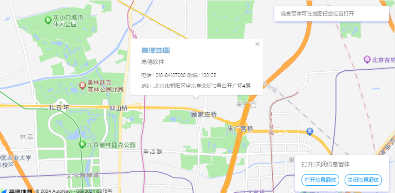
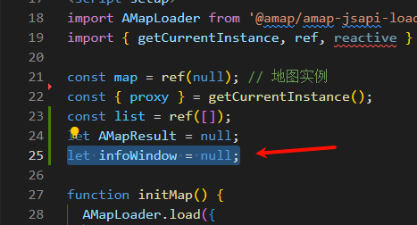
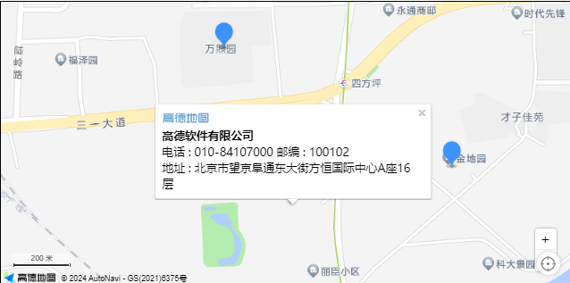
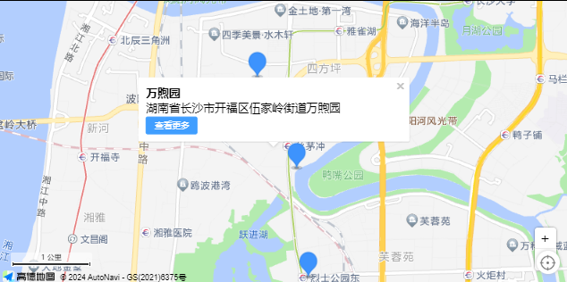
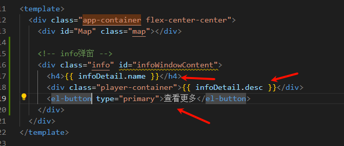

# 04-添加信息窗体

::: tip

基础代码基于上一篇，跳过看的、请先看一眼《03-添加点标记》成品代码

[传送门](https://gbm2001.github.io/vitepress-notice/column/vue/gdMap/03-%E6%B7%BB%E5%8A%A0%E7%82%B9%E6%A0%87%E8%AE%B0.html)

这一篇是结合点标记的，理解使用方法后，不需要点标记，你也可以随时随地弹出窗体

:::

上一篇写了，批量添加点标记，那么，这些标记点击的时候，是不是可以弹出窗体信息，这些信息是不是可以自定义呢？

看官方案例

> 我都会先贴一遍官方教程，然后再贴我自己优化过的vue版本教程

## 一、官方教程

[高德地图js api 2.0 信息窗体文档](https://lbs.amap.com/api/javascript-api-v2/guide/overlays/info-window)



### 1.1  默认信息窗体

默认信息窗体封装了关闭按钮，使用 API 默认的信息窗体样式，这个时候只需要对 `InfoWindow `设定 `content `属性即可，`content `可以是 `dom `对象，也可以是 `html `识别的字符串。

```js
// 信息窗体的内容
var content = [
    "<div> ",
    "<div style="\"padding:0px" 0px="" 4px;\"=""><b>高德软件有限公司</b>",
    "电话 : 010-84107000   邮编 : 100102",
    "地址 : 北京市望京阜通东大街方恒国际中心A座16层</div></div>"
];

// 创建 infoWindow 实例	
var infoWindow = new AMap.InfoWindow({
   content: content.join("<br>")  //传入 dom 对象，或者 html 字符串
});
  
// 打开信息窗体
infoWindow.open(map);
```

1.1 扩展(窗体锚点)

通过 `anchor `可以方便的设置锚点方位。

可选值

- top-left
- top-center
- top-right
- middle-left
- center
- middle-right
- bottom-left
- bottom-center
- bottom-right

```js
var infoWindow = new AMap.InfoWindow({
        anchor: 'top-left',
        content: '这是信息窗体！',
});

infoWindow.open(map,[116.401337,39.907886]);
```

### 1.2 自定义信息窗体

必须把 `InfoWindow` 的 `isCustom `属性设置为 true。

自定义信息窗体需要自己通过 `content `来实现关闭按钮以及全部外观样式，同时需要通过 `offset `指定锚点位置，`offset `为相对于 `content `下边缘中间点的位移：

```js
// 折线的节点坐标数组，每个元素为 AMap.LngLat 对象
var content = [
    "<div> ",
    "<div style="\"padding:0px" 0px="" 4px;\"=""><b>高德软件有限公司</b>",
    "电话 : 010-84107000   邮编 : 100102",
    "地址 : 北京市望京阜通东大街方恒国际中心A座16层</div></div>"
];

// 实现自定义窗体内容，返回拼接后的字符串
function createInfoWindow (title, content){
    // 内容拼接 ...
    return content;
}

// 创建 infoWindow 实例 
var infoWindow = new AMap.InfoWindow({
   isCustom: true,  //使用自定义窗体
   content: createInfoWindow(title,content.join("<br>")),  //传入 dom 对象，或者 html 字符串
   offset: new AMap.Pixel(16, -50)
});
```


有点看不明白是吧，我也是，看我vue改编后的写法


## 二、我的Vue教程

先贴了上一篇的代码，这一篇基于添加点标记

```html
<template>
  <div class="app-container flex-center-center">
    <div id="Map" class="map"></div>
  </div>
</template>

<script setup>
import AMapLoader from '@amap/amap-jsapi-loader';
import { getCurrentInstance, ref, reactive } from 'vue';

const map = ref(null); // 地图实例
const { proxy } = getCurrentInstance();
const list = ref([]);
let AMapResult = null;

function initMap() {
  AMapLoader.load({
    key: proxy.mapJsKey, // 申请好的Web端开发者Key，首次调用 load 时必填
    version: '2.0', // 指定要加载的 JSAPI 的版本，缺省时默认为 1.4.15
    resizeEnable: true, // 定位到当前位置
    plugins: [
      'AMap.ToolBar', // 缩放控件
      'AMap.Scale', // 比例尺
      'AMap.Geolocation', // 定位控件
    ], // 需要使用的的插件列表，如比例尺'AMap.Scale'等
  })
    .then((AMap) => {
      AMapResult = AMap;
      map.value = new AMapResult.Map('Map', {
        viewMode: '3D', //是否为3D地图模式
        zoom: 14, //初始化地图级别
        center: [113.005229, 28.227388],
      });
      map.value.addControl(new AMapResult.ToolBar()); // 工具条
      map.value.addControl(new AMapResult.Scale()); // 比例尺
      map.value.addControl(new AMapResult.Geolocation()); // 定位控件

      getList();
    })
    .catch((e) => {
      console.log(e);
    });
}
function getList() {
  let testList = [
    {
      longitude: 113.009312,
      latitude: 28.20836,
      name: '瑞丰家园',
      desc: '湖南省长沙市芙蓉区湘湖街道楚源茶社台球瑞丰家园',
    },
    {
      longitude: 113.007802,
      latitude: 28.221181,
      name: '通信建设有限公司',
      desc: '湖南省长沙市开福区四方坪街道湖南省通信建设有限公司',
    },
    {
      longitude: 113.010891,
      latitude: 28.228139,
      name: '金地园',
      desc: '湖南省长沙市开福区四方坪街道金地园',
    },
    {
      longitude: 113.002499,
      latitude: 28.231985,
      name: '万煦园',
      desc: '湖南省长沙市开福区伍家岭街道万煦园',
    },
  ];
  setTimeout(() => {
    list.value = testList;
    setMarker();
  }, 1000);
}
function setMarker() {
  // 创建一个 Icon
  let icon = new AMapResult.Icon({
    // 图标尺寸
    size: new AMapResult.Size(30, 40),
    // 图标的取图地址
    image: 'https://a.amap.com/jsapi_demos/static/demo-center/icons/poi-marker-default.png',
    // image: new URL('@/assets/images/location.png', import.meta.url).href,
    // 图标所用图片大小
    imageSize: new AMapResult.Size(30, 40),
    // 图标取图偏移量
    // imageOffset: new AMapResult.Pixel(-9, -3),
  });
  list.value.forEach((item) => {
    let marker = new AMapResult.Marker({
      // 经纬度对象，new AMap.LngLat(116.405467, 39.907761)
      // 也可以是经纬度构成的一维数组[116.39, 39.9]
      position: [item.longitude, item.latitude],
      offset: new AMapResult.Pixel(-10, -34),
      icon: icon,
    });
    map.value.add(marker); // 批量添加
  });
  map.value.setFitView(); // 所有点显示在窗口内
}

initMap();
</script>

<style lang="scss" scoped>
.app-container {
  padding: 30px;
  .map {
    width: 800px;
    height: 400px;
    border: 1px solid #000;
  }
}
</style>
```


### 2.1 添加默认信息窗体

这里我为中心点添加窗体，那4个点标记先不动，等下搞他。

#### 添加变量

其实加不加好像没啥大区别，毕竟只是加一个默认窗体，作为map插件的实例对象，还是加一个吧，这里我不用`ref`声明了，我感觉加个`.value`丑得很。

::: info

这一篇结束，我会把后面的map实例改为普通的变量，不使用ref声明，只有模拟数据才用ref

:::

```js
let infoWindow = null;
```




#### 编写方法

`setInfoWindow`

```js
function setInfoWindow() {
  let content = `
  
  <div><b>高德软件有限公司</b></div>
  <div>电话 : 010-84107000   邮编 : 100102</div>
  <div>地址 : 北京市望京阜通东大街方恒国际中心A座16层</div>
  `;
  infoWindow = new AMapResult.InfoWindow();
  infoWindow.setContent(content);
  infoWindow.open(map.value, [113.005229, 28.227388]);
}
```

#### 添加方法

```js
    ...
	.then((AMap) => {
      AMapResult = AMap;
      map.value = new AMapResult.Map('Map', {
        viewMode: '3D', //是否为3D地图模式
        zoom: 14, //初始化地图级别
        center: [113.005229, 28.227388],
      });
      map.value.addControl(new AMapResult.ToolBar()); // 工具条
      map.value.addControl(new AMapResult.Scale()); // 比例尺
      map.value.addControl(new AMapResult.Geolocation()); // 定位控件

      getList();
      setInfoWindow(); // [!code ++]
    })
    .catch((e) => {
      console.log(e);
    });
```

#### 查看效果

::: tip

数据是复制高德地图的，并不是真实该地点信息

:::




### 2.2 自定义窗体信息

上面那个格式，丑不拉几，而且还是字符串定义的

我要自己写！

#### （1）js变量

定义一个详情变量，等下扩展要用，这里窗体也要用

```js
import AMapLoader from '@amap/amap-jsapi-loader';
import { getCurrentInstance, ref, reactive } from 'vue';

const map = ref(null); // 地图实例
const { proxy } = getCurrentInstance();
const data = reactive({ // [!code ++]
  infoDetail: {}, // [!code ++]
}); // [!code ++]
const { infoDetail } = toRefs(data); // [!code ++]

const list = ref([]);
let AMapResult = null;
let infoWindow = null; // [!code ++]
```


#### （2）html页面代码

定义id是用来获取的

```html
<!-- info弹窗 -->
<div class="info" id="infoWindowContent">
    <h4>{{ infoDetail.name }}</h4>
    <div class="player-container">{{ infoDetail.desc }}</div>
    <el-button type="primary">查看更多</el-button>
</div>
```


放在div.app-container中

```html {6-10}
<template>
  <div class="app-container flex-center-center">
    <div id="Map" class="map"></div>

    <!-- info弹窗 -->
    <div class="info" id="infoWindowContent">
      <h4>{{ infoDetail.name }}</h4>
      <div class="player-container">{{ infoDetail.desc }}</div>
      <el-button type="primary">查看更多</el-button>
    </div>
  </div>
</template>
```

#### （3）css样式

> 这里看你自己的设计图了，我这里没啥好弄得，就是一个宽度，一个隐藏

```css
.info {
  display: none;
  width: 350px;
}
```

#### （4）js方法

```js
function setInfoWindow() {
  infoWindow = new AMapResult.InfoWindow({
    autoMove: true, // 为true表示自定义窗体 // [!code ++]
  });
  let infoWindowContent = document.getElementById('infoWindowContent');  // [!code ++]
  infoWindowContent.style.display = 'block'; // [!code ++]
  infoDetail.value = {
    longitude: 113.002499,
    latitude: 28.231985,
    name: '万煦园',
    desc: '湖南省长沙市开福区伍家岭街道万煦园',
  };
  infoWindow.setContent(infoWindowContent); // [!code warning]
  infoWindow.open(map.value, [113.005229, 28.227388]);
}
```

#### （5）效果图



可以看到这个就是我的自定义的页面上的内容，至于样式，写法，你都可以自定义




#### （6）成品

```html
<template>
  <div class="app-container flex-center-center">
    <div id="Map" class="map"></div>

    <!-- info弹窗 -->
    <div class="info" id="infoWindowContent">
      <h4>{{ infoDetail.name }}</h4>
      <div class="player-container">{{ infoDetail.desc }}</div>
      <el-button type="primary">查看更多</el-button>
    </div>
  </div>
</template>

<script setup>
import AMapLoader from '@amap/amap-jsapi-loader';
import { getCurrentInstance, ref, reactive } from 'vue';

const map = ref(null); // 地图实例
const { proxy } = getCurrentInstance();
const data = reactive({
  infoDetail: {},
});
const { infoDetail } = toRefs(data);

const list = ref([]);
let AMapResult = null;
let infoWindow = null;

function initMap() {
  AMapLoader.load({
    key: proxy.mapJsKey, // 申请好的Web端开发者Key，首次调用 load 时必填
    version: '2.0', // 指定要加载的 JSAPI 的版本，缺省时默认为 1.4.15
    resizeEnable: true, // 定位到当前位置
    plugins: [
      'AMap.ToolBar', // 缩放控件
      'AMap.Scale', // 比例尺
      'AMap.Geolocation', // 定位控件
    ], // 需要使用的的插件列表，如比例尺'AMap.Scale'等
  })
    .then((AMap) => {
      AMapResult = AMap;
      map.value = new AMapResult.Map('Map', {
        viewMode: '3D', //是否为3D地图模式
        zoom: 14, //初始化地图级别
        center: [113.005229, 28.227388],
      });
      map.value.addControl(new AMapResult.ToolBar()); // 工具条
      map.value.addControl(new AMapResult.Scale()); // 比例尺
      map.value.addControl(new AMapResult.Geolocation()); // 定位控件

      getList();
      setInfoWindow();
    })
    .catch((e) => {
      console.log(e);
    });
}
function getList() {
  let testList = [
    {
      longitude: 113.009312,
      latitude: 28.20836,
      name: '瑞丰家园',
      desc: '湖南省长沙市芙蓉区湘湖街道楚源茶社台球瑞丰家园',
    },
    {
      longitude: 113.007802,
      latitude: 28.221181,
      name: '通信建设有限公司',
      desc: '湖南省长沙市开福区四方坪街道湖南省通信建设有限公司',
    },
    {
      longitude: 113.010891,
      latitude: 28.228139,
      name: '金地园',
      desc: '湖南省长沙市开福区四方坪街道金地园',
    },
    {
      longitude: 113.002499,
      latitude: 28.231985,
      name: '万煦园',
      desc: '湖南省长沙市开福区伍家岭街道万煦园',
    },
  ];
  setTimeout(() => {
    list.value = testList;
    setMarker();
  }, 1000);
}
function setMarker() {
  // 创建一个 Icon
  let icon = new AMapResult.Icon({
    // 图标尺寸
    size: new AMapResult.Size(30, 40),
    // 图标的取图地址
    image: 'https://a.amap.com/jsapi_demos/static/demo-center/icons/poi-marker-default.png',
    // image: new URL('@/assets/images/location.png', import.meta.url).href,
    // 图标所用图片大小
    imageSize: new AMapResult.Size(30, 40),
    // 图标取图偏移量
    // imageOffset: new AMapResult.Pixel(-9, -3),
  });
  list.value.forEach((item) => {
    let marker = new AMapResult.Marker({
      // 经纬度对象，new AMap.LngLat(116.405467, 39.907761)
      // 也可以是经纬度构成的一维数组[116.39, 39.9]
      position: [item.longitude, item.latitude],
      offset: new AMapResult.Pixel(-10, -34),
      icon: icon,
    });
    map.value.add(marker); // 批量添加
  });
  map.value.setFitView(); // 所有点显示在窗口内
}
function setInfoWindow() {
  infoWindow = new AMapResult.InfoWindow({
    autoMove: true, // 为true表示自定义窗体
  });
  let infoWindowContent = document.getElementById('infoWindowContent');
  infoWindowContent.style.display = 'block';
  infoDetail.value = {
    longitude: 113.002499,
    latitude: 28.231985,
    name: '万煦园',
    desc: '湖南省长沙市开福区伍家岭街道万煦园',
  };
  infoWindow.setContent(infoWindowContent);
  infoWindow.open(map.value, [113.005229, 28.227388]);
}
initMap();
</script>

<style lang="scss" scoped>
.app-container {
  padding: 30px;
  .map {
    width: 800px;
    height: 400px;
    border: 1px solid #000;
  }

  .info {
    display: none;
    width: 350px;
  }
}
</style>
```

