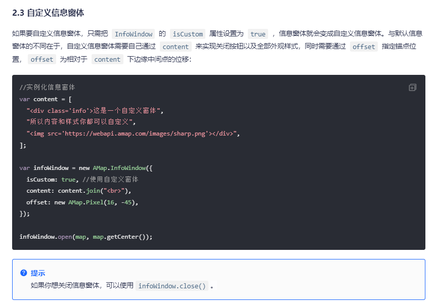

# 05-循环点标记并点击弹出窗体

同理，本篇基于上一篇信息窗体的代码，请先去cv成品，或阅读完上一篇成品代码，再看这一篇。

[【vue2高德地图api】高德地图forEach批量添加marker点标记，点击获取item对象『全网最详细』【翻遍csdn总结】](https://blog.csdn.net/qq_51055690/article/details/134019246?spm=1001.2014.3001.5502)


## 变量

```
import AMapLoader from '@amap/amap-jsapi-loader';
import { getCurrentInstance, ref, reactive } from 'vue';

const map = ref(null); // 地图实例
const { proxy } = getCurrentInstance();
const data = reactive({
  infoDetail: {},
});
const { infoDetail } = toRefs(data);

const list = ref([]);
let AMapResult = null;
let infoWindow = null;
```

::: tip

 infoDetail是一个ref变量

:::


## 一、自定义窗体


```html
<!-- info弹窗 -->
<div class="info" id="infoWindowContent">
  <h4>{{ infoDetail.name }}</h4>
  <div class="player-container">{{ infoDetail.desc }}</div>
  <el-button type="primary">查看更多</el-button>
</div>
```

样式就是给`info`一个` display: none;`

## 二、修改js方法

`initMap`方法

```js
	  ...
      map.value.addControl(new AMapResult.ToolBar()); // 工具条
      map.value.addControl(new AMapResult.Scale()); // 比例尺
      map.value.addControl(new AMapResult.Geolocation()); // 定位控件

      getList();
      setInfoWindow();// 这里先删除掉 // [!code --]
    })
    .catch((e) => {
      console.log(e);
    });
```

`getList`方法

```js
function getList() {
  let testList = [
    {
      longitude: 113.009312,
      latitude: 28.20836,
      name: '瑞丰家园',
      desc: '湖南省长沙市芙蓉区湘湖街道楚源茶社台球瑞丰家园',
    },
    {
      longitude: 113.007802,
      latitude: 28.221181,
      name: '通信建设有限公司',
      desc: '湖南省长沙市开福区四方坪街道湖南省通信建设有限公司',
    },
    {
      longitude: 113.010891,
      latitude: 28.228139,
      name: '金地园',
      desc: '湖南省长沙市开福区四方坪街道金地园',
    },
    {
      longitude: 113.002499,
      latitude: 28.231985,
      name: '万煦园',
      desc: '湖南省长沙市开福区伍家岭街道万煦园',
    },
  ];
  setTimeout(() => {
    list.value = testList;
    setMarker();
  }, 1000);
}
```

`setMarker`方法

```js
function setMarker() {
  // 创建一个 Icon
  let icon = new AMapResult.Icon({
    // 图标尺寸
    size: new AMapResult.Size(30, 40),
    // 图标的取图地址
    image: 'https://a.amap.com/jsapi_demos/static/demo-center/icons/poi-marker-default.png',
    // image: new URL('@/assets/images/location.png', import.meta.url).href,
    // 图标所用图片大小
    imageSize: new AMapResult.Size(30, 40),
    // 图标取图偏移量
    // imageOffset: new AMapResult.Pixel(-9, -3),
  });
  list.value.forEach((item) => {
    console.log(`item -->`, item);
    let marker = new AMapResult.Marker({
      // 经纬度对象，new AMap.LngLat(116.405467, 39.907761)
      // 也可以是经纬度构成的一维数组[116.39, 39.9]
      position: [item.longitude, item.latitude],
      offset: new AMapResult.Pixel(0, 0), //设置点标记偏移量
      anchor: 'bottom-center', //设置锚点方位
      icon: icon,
      extData: {  // [!code ++]
        item, // 简写,原写为item:item, 获取item属性,左侧键,右侧值  // [!code ++]
      }, // 写入你的item对象,很重要,否则点击获取不到item属性  // [!code ++]
    });
    map.value.add(marker); // 批量添加
    marker.on('click', (e) => { // [!code ++]
      infoDetail.value = e.target.getExtData().item; // 获取item , 这个getExtData()是AMap.Marker的扩展方法 // [!code ++]
      setInfoWindow(); // [!code ++]
    }); // [!code ++]
  });
  map.value.setFitView(); // 所有点显示在窗口内
}
```


## 三、setInfoWindow

```js
function setInfoWindow() {
  infoWindow = new AMapResult.InfoWindow({
    autoMove: true, // 为true表示自定义窗体
  });
  let infoWindowContent = document.getElementById('infoWindowContent');
  infoWindowContent.style.display = 'block';
  infoWindow.setContent(infoWindowContent);
  infoWindow.open(map.value, [infoDetail.value.longitude, infoDetail.value.latitude]);
}
```

- new AMapResult.InfoWindow 创建实例
- infoWindowContent 获取页面上的dom
- display = 'block';  展示div
- setContent 写入窗体内容
- open 指定坐标


## 四、全部代码

```html
<template>
  <div class="app-container flex-center-center">
    <div id="Map" class="map"></div>

    <!-- info弹窗 -->
    <div class="info" id="infoWindowContent">
      <h4>{{ infoDetail.name }}</h4>
      <div class="player-container">{{ infoDetail.desc }}</div>
      <el-button type="primary">查看更多</el-button>
    </div>
  </div>
</template>

<script setup>
import AMapLoader from '@amap/amap-jsapi-loader';
import { getCurrentInstance, ref, reactive } from 'vue';

const map = ref(null); // 地图实例
const { proxy } = getCurrentInstance();
const data = reactive({
  infoDetail: {},
});
const { infoDetail } = toRefs(data);

const list = ref([]);
let AMapResult = null;
let infoWindow = null;

function initMap() {
  AMapLoader.load({
    key: proxy.mapJsKey, // 申请好的Web端开发者Key，首次调用 load 时必填
    version: '2.0', // 指定要加载的 JSAPI 的版本，缺省时默认为 1.4.15
    resizeEnable: true, // 定位到当前位置
    plugins: [
      'AMap.ToolBar', // 缩放控件
      'AMap.Scale', // 比例尺
      'AMap.Geolocation', // 定位控件
    ], // 需要使用的的插件列表，如比例尺'AMap.Scale'等
  })
    .then((AMap) => {
      AMapResult = AMap;
      map.value = new AMapResult.Map('Map', {
        viewMode: '3D', //是否为3D地图模式
        zoom: 14, //初始化地图级别
        center: [113.005229, 28.227388],
      });
      map.value.addControl(new AMapResult.ToolBar()); // 工具条
      map.value.addControl(new AMapResult.Scale()); // 比例尺
      map.value.addControl(new AMapResult.Geolocation()); // 定位控件

      getList();
    })
    .catch((e) => {
      console.log(e);
    });
}
function getList() {
  let testList = [
    {
      longitude: 113.009312,
      latitude: 28.20836,
      name: '瑞丰家园',
      desc: '湖南省长沙市芙蓉区湘湖街道楚源茶社台球瑞丰家园',
    },
    {
      longitude: 113.007802,
      latitude: 28.221181,
      name: '通信建设有限公司',
      desc: '湖南省长沙市开福区四方坪街道湖南省通信建设有限公司',
    },
    {
      longitude: 113.010891,
      latitude: 28.228139,
      name: '金地园',
      desc: '湖南省长沙市开福区四方坪街道金地园',
    },
    {
      longitude: 113.002499,
      latitude: 28.231985,
      name: '万煦园',
      desc: '湖南省长沙市开福区伍家岭街道万煦园',
    },
  ];
  setTimeout(() => {
    list.value = testList;
    setMarker();
  }, 1000);
}
function setMarker() {
  // 创建一个 Icon
  let icon = new AMapResult.Icon({
    // 图标尺寸
    size: new AMapResult.Size(30, 40),
    // 图标的取图地址
    image: 'https://a.amap.com/jsapi_demos/static/demo-center/icons/poi-marker-default.png',
    // image: new URL('@/assets/images/location.png', import.meta.url).href,
    // 图标所用图片大小
    imageSize: new AMapResult.Size(30, 40),
    // 图标取图偏移量
    // imageOffset: new AMapResult.Pixel(-9, -3),
  });
  list.value.forEach((item) => {
    console.log(`item -->`, item);
    let marker = new AMapResult.Marker({
      // 经纬度对象，new AMap.LngLat(116.405467, 39.907761)
      // 也可以是经纬度构成的一维数组[116.39, 39.9]
      position: [item.longitude, item.latitude],
      offset: new AMapResult.Pixel(0, 0), //设置点标记偏移量
      anchor: 'bottom-center', //设置锚点方位
      icon: icon,
      extData: {
        item,
      }, // 写入你的item对象,很重要,否则点击获取不到item属性
    });
    map.value.add(marker); // 批量添加
    marker.on('click', (e) => {
      infoDetail.value = e.target.getExtData().item; // 获取item , 这个getExtData()是AMap.Marker的扩展方法
      setInfoWindow();
    });
  });
  map.value.setFitView(); // 所有点显示在窗口内
}
function setInfoWindow() {
  infoWindow = new AMapResult.InfoWindow({
    autoMove: true, // 为true表示自定义窗体
  });
  let infoWindowContent = document.getElementById('infoWindowContent');
  infoWindowContent.style.display = 'block';
  infoWindow.setContent(infoWindowContent);
  infoWindow.open(map.value, [infoDetail.value.longitude, infoDetail.value.latitude]);
}
initMap();
</script>

<style lang="scss" scoped>
.app-container {
  padding: 30px;
  .map {
    width: 800px;
    height: 400px;
    border: 1px solid #000;
  }

  .info {
    display: none;
    width: 350px;
  }
}
</style>
```


## 总结

重要难点在于

1. 自定义窗体信息
2. 循环点标记的同时，点击获取对应item（文档里都有，但是官方案例不明显）
3. 多看文档

[自定义点标记](https://lbs.amap.com/api/javascript-api-v2/guide/amap-marker/custom-marker)

[信息窗体](https://lbs.amap.com/api/javascript-api-v2/guide/overlays/info-window)

::: tip 官方案例



:::