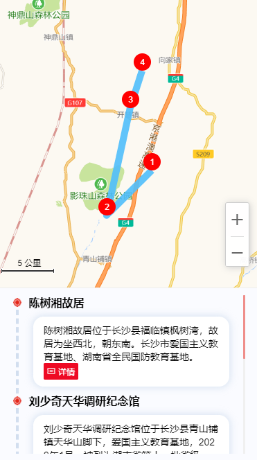
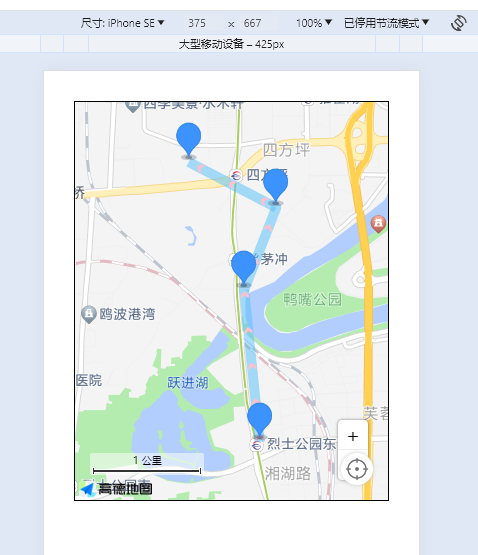

## 06-折线

这里只做简易版，并且折线外加点标记。

参考实现效果如下

> 


## 一、官方文档

[高德地图js2.0 折线 传送门==--==](https://lbs.amap.com/api/javascript-api-v2/guide/amap-line/poly-line)

### 1、绘制地图

```js
const map = new AMap.Map("container", {
  zoom: 10, //地图级别
  center: [116.397428, 39.90923], //地图中心点
  mapStyle: "amap://styles/whitesmoke", //设置地图的显示样式
  viewMode: "2D", //地图模式
});
```

### 2、配置坐标

```js
//配置折线路径
var path = [
  new AMap.LngLat(116.368904, 39.913423),
  new AMap.LngLat(116.382122, 39.901176),
  new AMap.LngLat(116.387271, 39.912501),
  new AMap.LngLat(116.398258, 39.9046),
];
```

### 3、创建实例

```js
//创建 Polyline 实例
var polyline = new AMap.Polyline({
  path: path,
  borderWeight: 2, //线条宽度，默认为1
  strokeColor: "red", //线条颜色
  lineJoin: "round", //折线拐点连接处样式
});
```

### 4、添加实例

```js
map.add(polyline);
```


## 二、复制代码并修改

复制上一篇代码，删除`setInfoWindow`方法

保留`initMap`，`getList`，`setMarker`，三个方法

```html
<template>
  <div class="app-container flex-center-center">
    <div id="Map" class="map"></div>
  </div>
</template>

<script setup>
import AMapLoader from '@amap/amap-jsapi-loader';
import { getCurrentInstance, ref, reactive } from 'vue';

const map = ref(null); // 地图实例
const { proxy } = getCurrentInstance();
const data = reactive({
  infoDetail: {},
});
const { infoDetail } = toRefs(data);

const list = ref([]);
let AMapResult = null;
let infoWindow = null;

function initMap() {
  AMapLoader.load({
    key: proxy.mapJsKey, // 申请好的Web端开发者Key，首次调用 load 时必填
    version: '2.0', // 指定要加载的 JSAPI 的版本，缺省时默认为 1.4.15
    resizeEnable: true, // 定位到当前位置
    plugins: [
      'AMap.ToolBar', // 缩放控件
      'AMap.Scale', // 比例尺
      'AMap.Geolocation', // 定位控件
    ], // 需要使用的的插件列表，如比例尺'AMap.Scale'等
  })
    .then((AMap) => {
      AMapResult = AMap;
      map.value = new AMapResult.Map('Map', {
        viewMode: '3D', //是否为3D地图模式
        zoom: 14, //初始化地图级别
        center: [113.005229, 28.227388],
      });
      map.value.addControl(new AMapResult.ToolBar()); // 工具条
      map.value.addControl(new AMapResult.Scale()); // 比例尺
      map.value.addControl(new AMapResult.Geolocation()); // 定位控件

      getList();
    })
    .catch((e) => {
      console.log(e);
    });
}
function getList() {
  let testList = [
    {
      longitude: 113.009312,
      latitude: 28.20836,
      name: '瑞丰家园',
      desc: '湖南省长沙市芙蓉区湘湖街道楚源茶社台球瑞丰家园',
    },
    {
      longitude: 113.007802,
      latitude: 28.221181,
      name: '通信建设有限公司',
      desc: '湖南省长沙市开福区四方坪街道湖南省通信建设有限公司',
    },
    {
      longitude: 113.010891,
      latitude: 28.228139,
      name: '金地园',
      desc: '湖南省长沙市开福区四方坪街道金地园',
    },
    {
      longitude: 113.002499,
      latitude: 28.231985,
      name: '万煦园',
      desc: '湖南省长沙市开福区伍家岭街道万煦园',
    },
  ];
  setTimeout(() => {
    list.value = testList;
    setMarker();
  }, 1000);
}
function setMarker() {
  // 创建一个 Icon
  let icon = new AMapResult.Icon({
    // 图标尺寸
    size: new AMapResult.Size(30, 40),
    // 图标的取图地址
    image: 'https://a.amap.com/jsapi_demos/static/demo-center/icons/poi-marker-default.png',
    // image: new URL('@/assets/images/location.png', import.meta.url).href,
    // 图标所用图片大小
    imageSize: new AMapResult.Size(30, 40),
    // 图标取图偏移量
    // imageOffset: new AMapResult.Pixel(-9, -3),
  });
  list.value.forEach((item) => {
    console.log(`item -->`, item);
    let marker = new AMapResult.Marker({
      // 经纬度对象，new AMap.LngLat(116.405467, 39.907761)
      // 也可以是经纬度构成的一维数组[116.39, 39.9]
      position: [item.longitude, item.latitude],
      offset: new AMapResult.Pixel(0, 0), //设置点标记偏移量
      anchor: 'bottom-center', //设置锚点方位
      icon: icon,
      extData: {
        item,
      }, // 写入你的item对象,很重要,否则点击获取不到item属性
    });
    map.value.add(marker); // 批量添加
  });
  map.value.setFitView(); // 所有点显示在窗口内
}

initMap();
</script>

<style lang="scss" scoped>
.app-container {
  padding: 30px;
  .map {
    width: 800px;
    height: 400px;
    border: 1px solid #000;
  }

  .info {
    display: none;
    width: 350px;
  }
}
</style>

```

## 三、编写setPolyline方法

由于折线我这里是一次性使用，所以没有去创建变量，它不是常用实例，没有多余的方法，所以直接在写入的这里用了。


::: tip

接收的参数**path**，是一个数组。

:::

其他参数看文档

```js
function setPolyline() {
  const path = list.value.map((item) => {
    return [item.longitude, item.latitude];
  });
  let polyline = new AMapResult.Polyline({
    path: path,
    strokeWeight: 10, // 轮廓线宽度
    showDir: true, // 是否延路径显示白色方向箭头,默认false。建议折线宽度大于6时使用
    // dirImg:'https://a.amap.com/jsapi_demos/static/images/mass0.png',
    // dirImg:canvasDir,
    strokeColor: '#50BEFB', // 线条颜色
    dirColor: 'pink',
    lineJoin: 'round', // 折线拐点连接处样式
  });
  map.value.add(polyline);
}
```

在getList方法下执行

```js
  ...
  setTimeout(() => {
    list.value = testList;
    setMarker();
    setPolyline(); // [!code ++]
  }, 1000);
```


## 四、效果

> 
>
> 


## 五、成品代码

::: tip

需要安装和配置

:::

```
npm i @amap/amap-jsapi-loader --save
```

`main.js`

```
app.config.globalProperties.mapJsKey = ''; // key
```


---

```html
<template>
  <div class="app-container flex-center-center">
    <div id="Map" class="map"></div>
  </div>
</template>

<script setup>
import AMapLoader from '@amap/amap-jsapi-loader';
import { getCurrentInstance, ref, reactive } from 'vue';

const map = ref(null); // 地图实例
const { proxy } = getCurrentInstance();
const data = reactive({
  infoDetail: {},
});
const { infoDetail } = toRefs(data);

const list = ref([]);
let AMapResult = null;
let infoWindow = null;

function initMap() {
  AMapLoader.load({
    key: proxy.mapJsKey, // 申请好的Web端开发者Key，首次调用 load 时必填
    version: '2.0', // 指定要加载的 JSAPI 的版本，缺省时默认为 1.4.15
    resizeEnable: true, // 定位到当前位置
    plugins: [
      'AMap.ToolBar', // 缩放控件
      'AMap.Scale', // 比例尺
      'AMap.Geolocation', // 定位控件
    ], // 需要使用的的插件列表，如比例尺'AMap.Scale'等
  })
    .then((AMap) => {
      AMapResult = AMap;
      map.value = new AMapResult.Map('Map', {
        viewMode: '3D', //是否为3D地图模式
        zoom: 14, //初始化地图级别
        center: [113.005229, 28.227388],
      });
      map.value.addControl(new AMapResult.ToolBar()); // 工具条
      map.value.addControl(new AMapResult.Scale()); // 比例尺
      map.value.addControl(new AMapResult.Geolocation()); // 定位控件

      getList();
    })
    .catch((e) => {
      console.log(e);
    });
}
function getList() {
  let testList = [
    {
      longitude: 113.009312,
      latitude: 28.20836,
      name: '瑞丰家园',
      desc: '湖南省长沙市芙蓉区湘湖街道楚源茶社台球瑞丰家园',
    },
    {
      longitude: 113.007802,
      latitude: 28.221181,
      name: '通信建设有限公司',
      desc: '湖南省长沙市开福区四方坪街道湖南省通信建设有限公司',
    },
    {
      longitude: 113.010891,
      latitude: 28.228139,
      name: '金地园',
      desc: '湖南省长沙市开福区四方坪街道金地园',
    },
    {
      longitude: 113.002499,
      latitude: 28.231985,
      name: '万煦园',
      desc: '湖南省长沙市开福区伍家岭街道万煦园',
    },
  ];
  setTimeout(() => {
    list.value = testList;
    setMarker();
    setPolyline();
  }, 1000);
}
function setMarker() {
  // 创建一个 Icon
  let icon = new AMapResult.Icon({
    // 图标尺寸
    size: new AMapResult.Size(30, 40),
    // 图标的取图地址
    image: 'https://a.amap.com/jsapi_demos/static/demo-center/icons/poi-marker-default.png',
    // image: new URL('@/assets/images/location.png', import.meta.url).href,
    // 图标所用图片大小
    imageSize: new AMapResult.Size(30, 40),
    // 图标取图偏移量
    // imageOffset: new AMapResult.Pixel(-9, -3),
  });
  list.value.forEach((item) => {
    console.log(`item -->`, item);
    let marker = new AMapResult.Marker({
      // 经纬度对象，new AMap.LngLat(116.405467, 39.907761)
      // 也可以是经纬度构成的一维数组[116.39, 39.9]
      position: [item.longitude, item.latitude],
      offset: new AMapResult.Pixel(0, 0), //设置点标记偏移量
      anchor: 'bottom-center', //设置锚点方位
      icon: icon,
      extData: {
        item,
      }, // 写入你的item对象,很重要,否则点击获取不到item属性
    });
    map.value.add(marker); // 批量添加
  });
  map.value.setFitView(); // 所有点显示在窗口内
}

function setPolyline() {
  const path = list.value.map((item) => {
    return [item.longitude, item.latitude];
  });

  let polyline = new AMapResult.Polyline({
    path: path,
    strokeWeight: 10, // 轮廓线宽度
    showDir: true, // 是否延路径显示白色方向箭头,默认false。建议折线宽度大于6时使用
    // dirImg: 'https://a.amap.com/jsapi_demos/static/images/mass0.png',
    // dirImg:canvasDir,
    strokeColor: '#50BEFB', // 线条颜色
    dirColor: 'pink',
    lineJoin: 'round', // 折线拐点连接处样式
  });
  map.value.add(polyline);
}

initMap();
</script>

<style lang="scss" scoped>
.app-container {
  padding: 30px;
  .map {
    width: 800px;
    height: 400px;
    border: 1px solid #000;
  }

  .info {
    display: none;
    width: 350px;
  }
}
</style>

```

