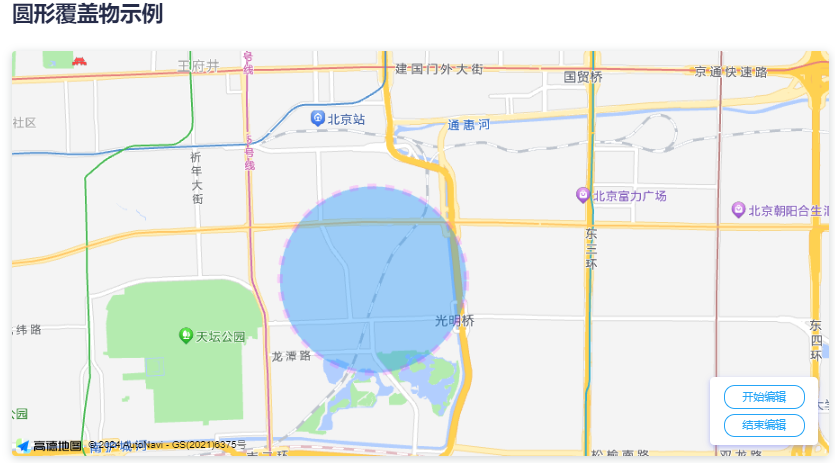
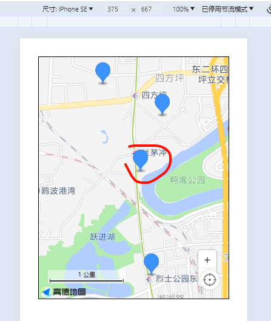
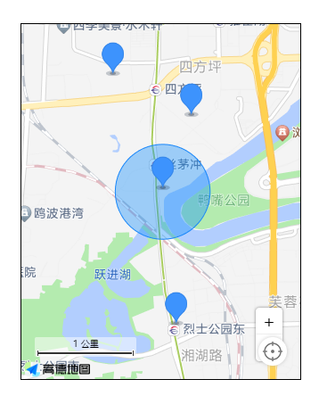

## 07-圆形绘制

需要显示圆形范围之类的，打卡范围之类的功能，就需要用到圆形绘制。

- [ ] 多边形
- [x] 圆形
- [ ] 矩形
- [ ] 椭圆形

## 一、官方文档

[圆形绘制和编辑 - 传送门](https://lbs.amap.com/api/javascript-api-v2/guide/amap-polygon/circle)

[参考手册](https://lbs.amap.com/api/javascript-api-v2/documentation#circle)

### 1、创建地图

```js
//创建地图
var map = new AMap.Map("container", {
  center: [116.433322, 39.900256], //地图中心点
  mapStyle: "amap://styles/whitesmoke", //地图的显示样式
  viewMode: "2D", //地图模式
  zoom: 14, //地图级别
});
```

### 2、设置圆心和半径

```js
//设置圆形位置
var center = new AMap.LngLat(116.433322, 39.900255);
//设置圆的半径大小
var radius = 1000;
```

### 3、创建实例

```js
//创建圆形 Circle 实例
var circle = new AMap.Circle({
  center: center, //圆心
  radius: radius, //半径
  borderWeight: 3, //描边的宽度
  strokeColor: "#FF33FF", //轮廓线颜色
  strokeOpacity: 1, //轮廓线透明度
  strokeWeight: 6, //轮廓线宽度
  fillOpacity: 0.4, //圆形填充透明度
  strokeStyle: "dashed", //轮廓线样式
  strokeDasharray: [10, 10],
  fillColor: "#1791fc", //圆形填充颜色
  zIndex: 50, //圆形的叠加顺序
});
```

### 4、添加到地图

```js
//圆形 Circle 对象添加到 Map
map.add(circle);
//根据覆盖物范围调整视野
map.setFitView([ circle ])
```

> 

## 二、复制代码修改

复制上一篇，把折线方法setPolyline删除，保留基本的

开始吧

```html
<template>
  <div class="app-container flex-center-center">
    <div id="Map" class="map"></div>
  </div>
</template>

<script setup>
import AMapLoader from '@amap/amap-jsapi-loader';
import { getCurrentInstance, ref, reactive } from 'vue';

const map = ref(null); // 地图实例
const { proxy } = getCurrentInstance();
const data = reactive({
  infoDetail: {},
});
const { infoDetail } = toRefs(data);

const list = ref([]);
let AMapResult = null;
let infoWindow = null;

function initMap() {
  AMapLoader.load({
    key: proxy.mapJsKey, // 申请好的Web端开发者Key，首次调用 load 时必填
    version: '2.0', // 指定要加载的 JSAPI 的版本，缺省时默认为 1.4.15
    resizeEnable: true, // 定位到当前位置
    plugins: [
      'AMap.ToolBar', // 缩放控件
      'AMap.Scale', // 比例尺
      'AMap.Geolocation', // 定位控件
    ], // 需要使用的的插件列表，如比例尺'AMap.Scale'等
  })
    .then((AMap) => {
      AMapResult = AMap;
      map.value = new AMapResult.Map('Map', {
        viewMode: '3D', //是否为3D地图模式
        zoom: 14, //初始化地图级别
        center: [113.005229, 28.227388],
      });
      map.value.addControl(new AMapResult.ToolBar()); // 工具条
      map.value.addControl(new AMapResult.Scale()); // 比例尺
      map.value.addControl(new AMapResult.Geolocation()); // 定位控件

      getList();
    })
    .catch((e) => {
      console.log(e);
    });
}
function getList() {
  let testList = [
    {
      longitude: 113.009312,
      latitude: 28.20836,
      name: '瑞丰家园',
      desc: '湖南省长沙市芙蓉区湘湖街道楚源茶社台球瑞丰家园',
    },
    {
      longitude: 113.007802,
      latitude: 28.221181,
      name: '通信建设有限公司',
      desc: '湖南省长沙市开福区四方坪街道湖南省通信建设有限公司',
    },
    {
      longitude: 113.010891,
      latitude: 28.228139,
      name: '金地园',
      desc: '湖南省长沙市开福区四方坪街道金地园',
    },
    {
      longitude: 113.002499,
      latitude: 28.231985,
      name: '万煦园',
      desc: '湖南省长沙市开福区伍家岭街道万煦园',
    },
  ];
  setTimeout(() => {
    list.value = testList;
    setMarker();
  }, 1000);
}
function setMarker() {
  // 创建一个 Icon
  let icon = new AMapResult.Icon({
    // 图标尺寸
    size: new AMapResult.Size(30, 40),
    // 图标的取图地址
    image: 'https://a.amap.com/jsapi_demos/static/demo-center/icons/poi-marker-default.png',
    // image: new URL('@/assets/images/location.png', import.meta.url).href,
    // 图标所用图片大小
    imageSize: new AMapResult.Size(30, 40),
    // 图标取图偏移量
    // imageOffset: new AMapResult.Pixel(-9, -3),
  });
  list.value.forEach((item) => {
    console.log(`item -->`, item);
    let marker = new AMapResult.Marker({
      // 经纬度对象，new AMap.LngLat(116.405467, 39.907761)
      // 也可以是经纬度构成的一维数组[116.39, 39.9]
      position: [item.longitude, item.latitude],
      offset: new AMapResult.Pixel(0, 0), //设置点标记偏移量
      anchor: 'bottom-center', //设置锚点方位
      icon: icon,
      extData: {
        item,
      }, // 写入你的item对象,很重要,否则点击获取不到item属性
    });
    map.value.add(marker); // 批量添加
  });
  map.value.setFitView(); // 所有点显示在窗口内
}

initMap();
</script>

<style lang="scss" scoped>
.app-container {
  padding: 30px;
  .map {
    width: 800px;
    height: 400px;
    border: 1px solid #000;
  }

  .info {
    display: none;
    width: 350px;
  }
}
</style>

```

## 三、思考分析

要实现的功能为，定位打卡。范围内打卡。

> 

据图分析，我以中心点为打卡点，以它为**圆心**，并且公司打卡一般是固定，那么这个坐标就可以固定写死

开始作图

### 1、绘制圆形 setCircle

在initMap里面执行画圆

```js
function setCircle() {
  //创建圆形 Circle 实例
  let circle = new AMapResult.Circle({
    center: [113.007802, 28.221181], //圆心
    radius: 500, //半径 单位是米\m,
    borderWeight: 3, //描边的宽度
    strokeColor: '#1987fa', //轮廓线颜色
    strokeOpacity: 1, //轮廓线透明度
    strokeWeight: 1, //轮廓线宽度
    fillOpacity: 0.4, //圆形填充透明度
    strokeStyle: 'solid', //轮廓线样式 ("solid" | "dashed")
    strokeDasharray: [10, 10],
    fillColor: '#1791fc', //圆形填充颜色
    zIndex: 50, //圆形的叠加顺序
  });
  map.value.add(circle); //将圆形添加到地图
  map.value.setFitView([circle]);
}
```



### 2、获取当前坐标

具体参考**01-简易实现页面展示**

```js
let geolocation = new AMapResult.Geolocation({
    //定位
    enableHighAccuracy: true, //是否使用高精度定位，默认:true
    timeout: 5000, //超过10秒后停止定位，默认：无穷大
    maximumAge: 0, //定位结果缓存0毫秒，默认：0
    convert: true, //自动偏移坐标，偏移后的坐标为高德坐标，默认：true
    showButton: true, //显示定位按钮，默认：true
    buttonPosition: 'RB', //定位按钮停靠位置，默认：'LB'，左下角
    buttonOffset: new AMap.Pixel(60, 20), //定位按钮与设置的停靠位置的偏移量，默认：Pixel(10, 20)
    showMarker: true, //定位成功后在定位到的位置显示点标记，默认：true
    showCircle: true, //定位成功后用圆圈表示定位精度范围，默认：true
    panToLocation: true, //定位成功后将定位到的位置作为地图中心点，默认：true
    zoomToAccuracy: true, //定位成功后调整地图视野范围使定位位置及精度范围视野内可见，默认：false
});
map.value.addControl(geolocation); //在地图上引入定位插件

geolocation.getCurrentPosition((status, result) => {
    if (status == 'complete') {
      locationInfo.value = result;
      // console.log('位置信息  complete: => ', result);
      // console.log('位置经纬度: => ', result.position);
      position.value = [result.position.lng, result.position.lat];
    } else {
      console.log('位置信息  error: =>', result);
    }
});
```

### 3、计算距离

获取到的当前位置，也有一个经纬度信息，并且中心点也是一个经纬度

工具

::: tip

传入的是纬度经度

不是经纬度，注意反过来

**latitude，longitude**

:::

`@/utils/distances.js`

```js
// 根据经纬度计算距离，参数分别为第一点的纬度，经度；第二点的纬度，经度
export function getDistances(lat1, lng1, lat2, lng2) {
  let EARTH_RADIUS = 6378.137; // 地球半径
  let radLat1 = (lat1 * Math.PI) / 180.0; //lat1 * Math.PI / 180.0=>弧度计算
  let radLat2 = (lat2 * Math.PI) / 180.0;
  let a = radLat1 - radLat2;
  let b = (lng1 * Math.PI) / 180.0 - (lng2 * Math.PI) / 180.0;
  let s =
    2 *
    Math.asin(
      Math.sqrt(Math.pow(Math.sin(a / 2), 2) + Math.cos(radLat1) * Math.cos(radLat2) * Math.pow(Math.sin(b / 2), 2))
    );
  s = s * EARTH_RADIUS;
  s = Math.round(s * 10000) / 10000; // 输出为公里
  return { m: Math.round(s * 1000), km: Number(s.toFixed(2)) };
}
```


`vue`

```
import { getDistances } from '@/utils/distances.js';
```

传入两个坐标，会返回一个对象

```
{
	m：**,
	km：****,
}
```

千米会有2位小数，米不会有小数。

一般打卡范围是200米

都看到这了，获取当前位置和计算距离，应该都会自己写了吧。主要讲思路。这里我没有去实现，跳过了。


