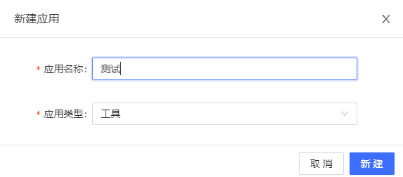
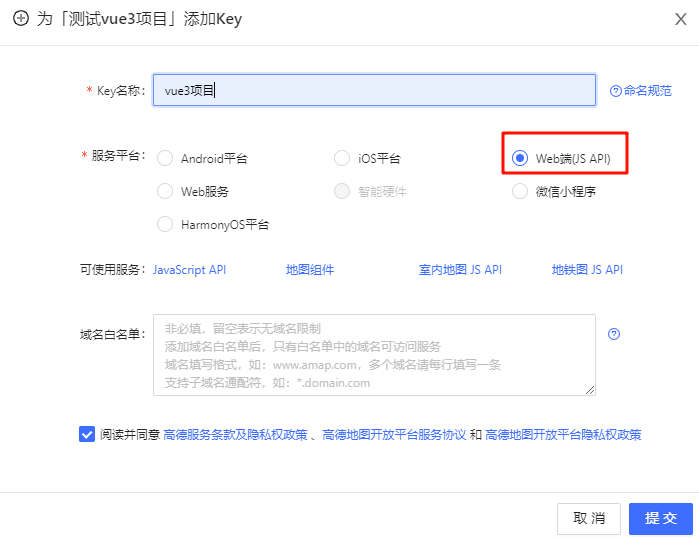
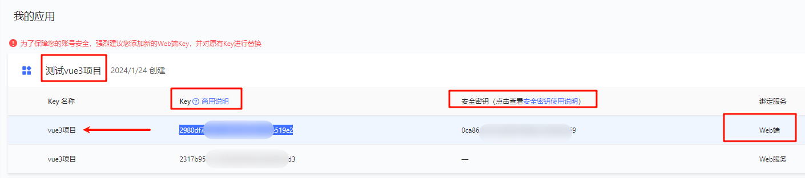
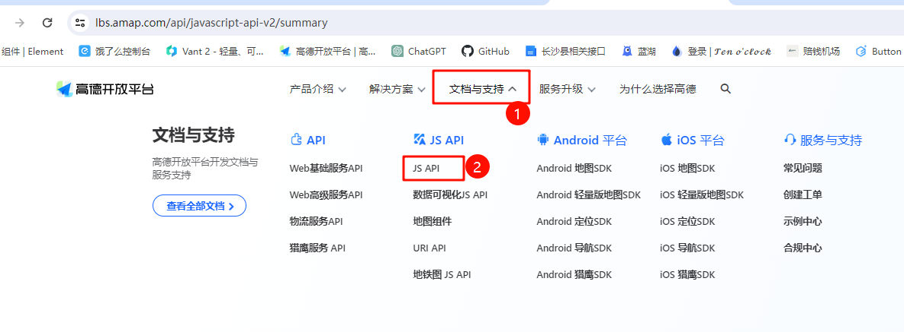

# 16-高德地图

::: tip 前提

已经搭建好了vite+vue3的项目脚手架，这里我尽量不触及vite内容，专注高德地图代码块

:::

## 前言

### 1.注册高德地图开发者

[高德开放平台](https://lbs.amap.com/)

- `右上角`=>控制台
- `左侧目录`=>应用管理=>我的目录
- 
- 

工具类型随便选，名称随便输入，这个只是用来你自己看的

### 2.创建key

右侧点击添加key

::: tip

web端（js api）是展示的

web服务，这个是调接口的

:::

> 

创建好web端(js api)之后，你会在页面上看到`key`和`密钥`

这里我还申请了web服务，建议你也申请，后续要用。

### 3.官方文档

[高德开放平台官网](https://lbs.amap.com/)

[地图js api文档传送门](https://lbs.amap.com/api/javascript-api-v2/summary)

---

